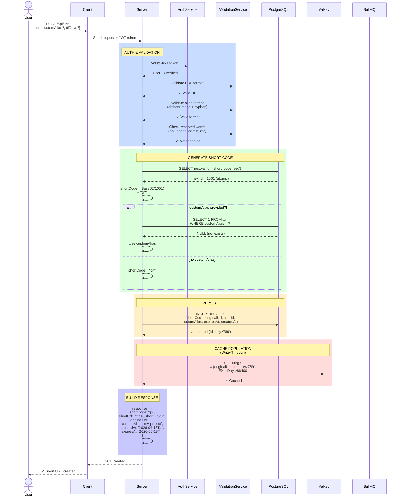
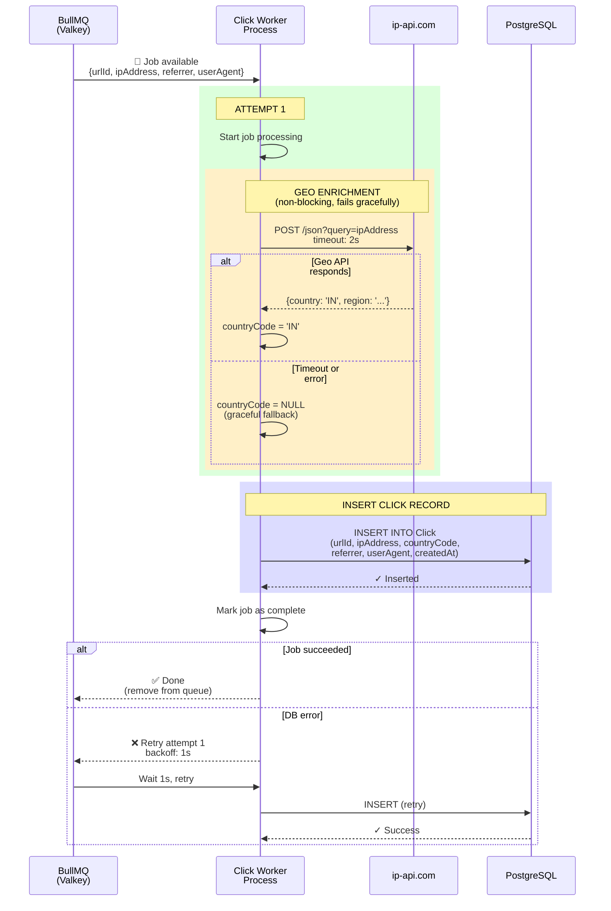
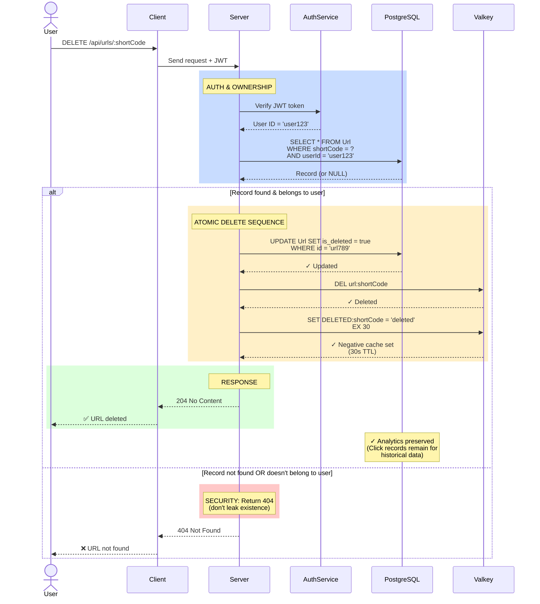
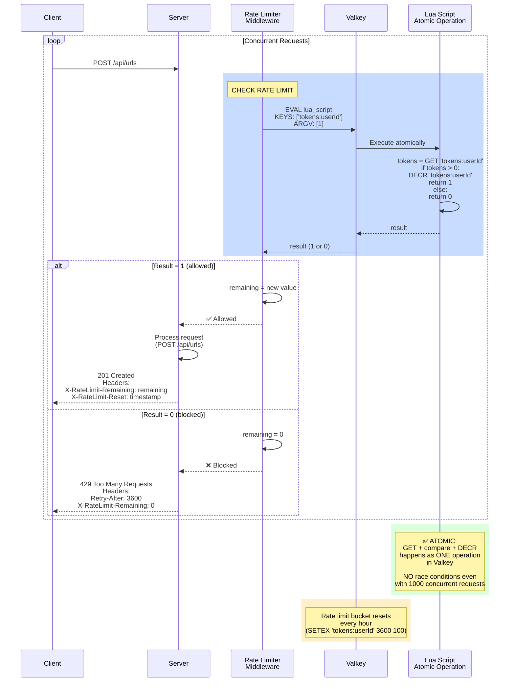
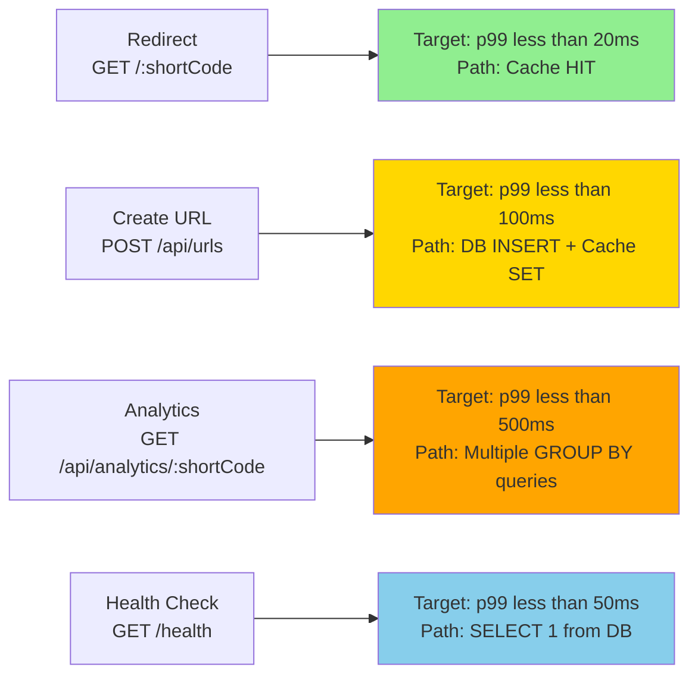

# System Flows — Mermaid Diagrams

**Status:** Locked (Pre-Implementation)  
**Last Updated:** 2026-07-17 (client-side 401 handling noted on Flow 8; client delete-account + 429 handling noted on Flows 9 and 7)  
**Purpose:** Visual specification of data flow through the system

---

## Flow 1: Create Short URL



---

## Flow 2: Redirect (Critical Path - Sub-2ms Target)

```mermaid
flowchart TD
    Start["GET /:shortCode<br/>(User clicks link)"]
    Start --> CacheCheck["🔍 Check Valkey<br/>key: 'url:shortCode'"]
    
    CacheCheck --> CacheHit{"Cache<br/>HIT?"}
    
    CacheHit -->|YES| UseCached["✅ Use cached<br/>{originalUrl, urlId}"]
    CacheHit -->|NO| DBQuery["📊 DB Query<br/>SELECT * FROM Url<br/>WHERE shortCode = ?"]
    
    DBQuery --> DBFound{"Record<br/>Found?"}
    
    DBFound -->|NO| SetNegCache1["⛔ Set negative cache<br/>DELETED:shortCode<br/>(30s TTL)"]
    SetNegCache1 --> Return404["Return 404<br/>Not Found"]
    Return404 --> End404["❌ End"]
    
    DBFound -->|YES| CheckStatus["Check URL status:<br/>is_deleted? expiresAt?"]
    
    CheckStatus --> IsValid{"Valid<br/>URL?"}
    
    IsValid -->|Deleted/Expired| SetNegCache2["⛔ Set negative cache<br/>DELETED:shortCode<br/>(30s TTL)"]
    SetNegCache2 --> Return410["Return 410<br/>Gone"]
    Return410 --> End410["❌ End"]
    
    IsValid -->|YES| CachePopulate["💾 Cache populate<br/>SET url:shortCode<br/>= {originalUrl, urlId}<br/>with TTL"]
    
    UseCached --> EnqueueClick["🚀 Fire-and-forget<br/>clickQueue.add({<br/>  urlId,<br/>  ipAddress,<br/>  referrer,<br/>  userAgent<br/>})<br/>⚡ DO NOT AWAIT"]
    
    CachePopulate --> EnqueueClick
    
    EnqueueClick --> Return302["📤 Return 302<br/>Location: originalUrl"]
    
    Return302 --> EndSuccess["✅ Redirect sent<br/>Latency: ~1-2ms"]
    
    rect rgb(255, 200, 200)
        note over EnqueueClick: CRITICAL: Must be<br/>non-blocking or entire<br/>architecture fails!
    end
    
    rect rgb(200, 255, 200)
        note over EndSuccess: Background:<br/>Worker consumes click,<br/>performs geo lookup,<br/>inserts to DB async
    end
```

**Click dedup (added 2026-08-04, DECISIONS.md #21):** the fire-and-forget enqueue above now
carries a client-generated `clickId`. BullMQ dedupes by `jobId = clickId`, and the worker's
insert is protected by a unique index on `click_events.clickId` with `ON CONFLICT DO NOTHING`
— so a double-fired or retried enqueue can never double-count a click. Note the dedup scope:
one `clickId` dedupes one click across retries; **intra-click-impression dedup (e.g. per
session) is explicitly out of scope.**

---

## Flow 3: Click Processing (Background Worker)



---

## Flow 4: Get Analytics

```mermaid
flowchart TD
    Start["GET /api/analytics/:shortCode<br/>with JWT token"]
    Start --> Auth["🔐 Authenticate user<br/>Verify JWT"]
    
    Auth --> AuthOK{"Auth<br/>valid?"}
    AuthOK -->|NO| Return401["Return 401<br/>Unauthorized"]
    Return401 --> End401["❌ End"]
    
    AuthOK -->|YES| OwnershipCheck["🔍 Ownership check<br/>SELECT * FROM Url<br/>WHERE shortCode = ?<br/>AND userId = currentUser"]
    
    OwnershipCheck --> Found{"Found &<br/>NOT deleted?"}
    Found -->|NO| Return404["Return 404<br/>Not Found"]
    Return404 --> End404["❌ End"]
    
    Found -->|YES| Query1["📊 Query 1: Total Clicks<br/>SELECT COUNT(*)<br/>FROM Click WHERE urlId = ?"]
    Query1 --> Total["totalClicks = N"]
    
    Total --> Query2["📊 Query 2: Last 7 Days<br/>SELECT COUNT(*)<br/>FROM Click<br/>WHERE urlId = ?<br/>AND createdAt >= now() - 7 days"]
    Query2 --> Last7["last7Days = M"]
    
    Last7 --> Query3["📊 Query 3: Daily Breakdown<br/>SELECT DATE(createdAt), COUNT(*)<br/>FROM Click<br/>GROUP BY DATE(createdAt)<br/>ORDER BY DATE DESC<br/>LIMIT 30"]
    Query3 --> Daily["dailyBreakdown = [...]"]
    
    Daily --> Query4["📊 Query 4: Top Referrers<br/>SELECT referrer, COUNT(*)<br/>FROM Click<br/>GROUP BY referrer<br/>ORDER BY COUNT DESC<br/>LIMIT 10"]
    Query4 --> Referrers["topReferrers = [...]"]
    
    Referrers --> Query5["📊 Query 5: Geographic<br/>SELECT countryCode, COUNT(*)<br/>FROM Click<br/>GROUP BY countryCode<br/>ORDER BY COUNT DESC<br/>LIMIT 20"]
    Query5 --> Countries["countries = [...]"]
    
    Countries --> BuildResponse["📦 Build JSON response<br/>{<br/>  shortCode,<br/>  originalUrl,<br/>  totalClicks,<br/>  last7Days,<br/>  dailyBreakdown,<br/>  topReferrers,<br/>  countries<br/>}"]
    
    BuildResponse --> Return200["Return 200 OK<br/>with full analytics"]
    Return200 --> EndSuccess["✅ Analytics delivered"]
    
    rect rgb(255, 240, 200)
        note over Query1,Query5: Note: No pre-aggregation in MVP<br/>All queries run on raw Click table<br/>Performance acceptable for less than 1M clicks
    end
```

---

## Flow 5: Delete URL (Soft Delete + Cache Invalidation)



---

## Flow 6: Redirect with Deleted URL (Next 30 Seconds)

```mermaid
flowchart TD
    Start["GET /:shortCode<br/>(URL was deleted ~10s ago)"]
    
    Start --> CacheCheck["🔍 Check Valkey<br/>key: 'url:shortCode'"]
    
    CacheCheck --> CacheHit{"Cache<br/>HIT?"}
    
    CacheHit -->|YES| UseCached["Use cached<br/>{originalUrl, urlId}<br/>(stale data!)"]
    UseCached --> Return302Stale["Return 302<br/>WRONG: serves old URL"]
    Return302Stale --> ⚠️["⚠️ BUG: User sees deleted URL"]
    
    CacheHit -->|NO| CheckNegCache["⛔ Check negative cache<br/>key: 'DELETED:shortCode'"]
    
    CheckNegCache --> NegCacheExists{"Negative<br/>cache<br/>exists?"}
    
    NegCacheExists -->|YES| Return410Fast["Return 410 Gone<br/>(from cache)<br/>⚡ 0 DB queries!"]
    Return410Fast --> Success410["✅ Deleted URL blocked"]
    
    NegCacheExists -->|NO<br/>expired| DBQuery["📊 DB Query<br/>SELECT * FROM Url<br/>WHERE shortCode = ?"]
    
    DBQuery --> DBCheck{"Record<br/>found &<br/>valid?"}
    
    DBCheck -->|NO or is_deleted| SetNegCache["⛔ Set DELETED:shortCode<br/>EX 30"]
    SetNegCache --> Return410DB["Return 410 Gone"]
    Return410DB --> Success410DB["✅ Blocked (after 30s expiry)"]
    
    DBCheck -->|YES| Proceed["URL still valid<br/>proceed normally"]
    Proceed --> Return302["Return 302"]
    
    rect rgb(200, 255, 200)
        note over Return410Fast: OPTIMIZATION:<br/>Negative cache prevents<br/>DB queries for 30s after delete!
    end
    
    rect rgb(255, 200, 200)
        note over ⚠️: POTENTIAL BUG:<br/>If url.ttl expires before<br/>being deleted, cache might<br/>contain stale data.
        note over ⚠️: Mitigation: Min(url.expiresAt, now() + cache_ttl)
    end
```

---

## Flow 7: Rate Limiter (Token Bucket with Lua Script)



**Also rate limited (added 2026-07-16, DECISIONS.md #16):** `POST /api/auth/register` (per IP)
and `POST /api/auth/login` (per IP **and** per submitted email — two independent buckets, both
must allow the request). Same fixed-window mechanism, different keys: `rl:register:<ip>`,
`rl:login:<ip>`, `rl:login:acct:<email>`.

**Client-side (implemented):** a `429` carries `{ error, retryAfter }` in the body (the CORS
config exposes no headers, so the client reads `retryAfter` from the body, not `Retry-After`).
The login/register forms surface it as a wait time, e.g. "Too many attempts. Please try again in
about a minute."

---

## Flow 8: Authentication Token Lifecycle

```mermaid
graph LR
    A["User logs in<br/>POST /api/auth/login"] --> B["Generate tokens<br/>Access: 10min<br/>Refresh: 30d"]
    
    B --> C["Send response<br/>accessToken in JSON<br/>refreshToken in<br/>httpOnly cookie"]
    
    C --> D["Client uses accessToken<br/>for API calls"]
    
    D --> E["Access token<br/>expires<br/>after 10 min"]
    
    E --> F{"Client<br/>retries<br/>request"}
    
    F -->|401 Unauthorized| G["Send refresh token<br/>POST /api/auth/refresh"]
    
    G --> H["Server validates<br/>refresh token<br/>checks DB for revocation"]
    
    H --> I{"Valid &<br/>not<br/>revoked?"}
    
    I -->|YES| J["Issue NEW<br/>access token<br/>+ new refresh token"]
    
    I -->|NO| K["Return 401<br/>Force re-login"]
    
    J --> L["Client retries<br/>with new accessToken"]
    
    L --> M["Request succeeds"]
    
    K --> N["Redirect to login page"]
    
    rect rgb(200, 255, 200)
        note over H: ✅ Refresh token<br/>stored in DB<br/>enables revocation<br/>on logout
    end
    
    rect rgb(255, 200, 200)
        note over G: httpOnly cookie<br/>prevents XSS theft<br/>browser sends automatically
    end
    
    O["User logs out"] --> P["POST /api/auth/logout"]
    P --> Q["Mark refresh token<br/>as revoked in DB"]
    Q --> Q2["Add access token's jti<br/>to Valkey denylist<br/>TTL = remaining life"]
    Q2 --> R["Clear cookie"]
    R --> S["Next attempt<br/>with old token fails"]
```

**Token-revocation behavior (added 2026-08-04, DECISIONS.md #18):** the access token is
stateless, so logout/account-deletion can't kill it by revoking the DB-backed refresh token
alone. Logout now pushes the access token's `jti` to a Valkey **denylist** (TTL = remaining
life); `authenticate` checks the denylist before trusting the signature, so a logged-out
token dies at its next use instead of living out its ≤10 min (DECISIONS.md #19). Fail-open:
if Valkey is down, the token survives to `exp`. Rotation (POST /api/auth/refresh) is
atomic-revoke-then-issue (DECISIONS.md #20): if the presented token is already revoked
(`count === 0`), **all** refresh tokens for the account are revoked and the user is forced to
re-login — the SEC-005 race is repurposed as a theft kill-switch.

**Client-side 401 handling (implemented — see DECISIONS.md #17):** the client runs the
refresh + retry above on *any* 401, then logs out **only if the refresh itself fails**. A 401
that survives a *successful* refresh is treated as a business error and surfaced (not a logout)
— this is what lets a wrong password on `DELETE /api/auth/account` show "Invalid password"
inline instead of bouncing the user to login. `POST /api/auth/login` opts out of this block
entirely (unauthenticated call), so its 401 = bad credentials surfaces directly.

---

## Flow 9: Delete Account (Anonymize + Cascade Soft-Delete)

```mermaid
sequenceDiagram
    actor User
    participant Client
    participant Server
    participant AuthService
    participant DB as PostgreSQL

    User->>Client: DELETE /api/auth/account<br/>{ password }
    Client->>Server: Send request + JWT + current password

    rect rgb(200, 220, 255)
        note over Server: AUTH & PASSWORD RE-VERIFICATION
        Server->>AuthService: Verify JWT token
        AuthService-->>Server: userId verified
        Server->>DB: SELECT passwordHash<br/>WHERE id = userId AND isActive = true
        DB-->>Server: Record (or NULL)
        Server->>Server: argon2.verify(hash, password)
    end

    alt Not authenticated, already inactive, or wrong password
        rect rgb(255, 200, 200)
            note over Server: Same generic message on any failure<br/>(no enumeration of "already deleted" vs "wrong password")
        end
        Server-->>Client: 401 { error: "Invalid password" }
    else Password verified
        rect rgb(255, 240, 200)
            note over Server,DB: ONE TRANSACTION (auth.repository.ts → deleteAccount)
            Server->>DB: UPDATE users SET<br/>email = 'deleted-&lt;userId&gt;@deleted.invalid',<br/>name = '', passwordHash = random(32),<br/>isActive = false<br/>WHERE id = userId
            DB-->>Server: ✓ Updated (trg_users_updated_at stamps updatedAt = deletion time)

            Server->>DB: UPDATE urls SET is_deleted = true<br/>WHERE userId = userId AND is_deleted = false
            DB-->>Server: ✓ All owned URLs soft-deleted

            Server->>DB: DELETE FROM refresh_tokens<br/>WHERE userId = userId
            DB-->>Server: ✓ Hard-deleted (purges stored User-Agent too)
        end

        rect rgb(220, 255, 220)
            note over DB: ✓ click_events preserved — same soft-delete<br/>principle as manual URL deletion (Decision 8)
        end

        Server-->>Client: 204 No Content<br/>Set-Cookie: refreshToken=; Max-Age=0
        Client-->>User: ✅ Account deleted, logged out
    end

    rect rgb(255, 200, 200)
        note over Server: Never a hard DELETE FROM users —<br/>urls → click_events cascade off users<br/>(onDelete: Cascade) would destroy analytics history (Decision 13)
    end
```

**Client-side (implemented):** the profile-menu **"Delete account"** item opens a confirm
dialog that collects the current password. On `204` the client clears its in-memory access
token + React Query cache and redirects to `/login` — it does **not** call `/logout` (the
account is already gone and the cookie is cleared server-side). On `401` it shows "Invalid
password" inline and keeps the user signed in (DECISIONS.md #17 — that 401 doesn't trigger a
logout).

---

## Summary: Component Interactions Diagram

```mermaid
graph TB
    User["👤 User<br/>Browser"]
    Client["Frontend<br/>Next.js"]
    Server["🖥️ Server<br/>Fastify + BullMQ Worker"]
    DB["🗄️ PostgreSQL<br/>User, Url, Click,<br/>RefreshToken"]
    Cache["⚡ Valkey<br/>Cache<br/>Sessions"]
    Queue["📨 BullMQ Queue<br/>Click Events"]
    GeoAPI["🌍 IP Geolocation API<br/>ip-api.com"]
    
    User -->|clicks link| Client
    Client -->|POST /api/urls| Server
    Client -->|GET /api/urls| Server
    Client -->|GET /:shortCode| Server
    
    Server -->|validate JWT| DB
    Server -->|read/write URLs| DB
    Server -->|cache lookups| Cache
    Server -->|enqueue clicks| Queue
    
    Queue -->|process job| Server
    Server -->|geo lookup| GeoAPI
    Server -->|insert Click| DB
    
    Cache -->|store sessions<br/>URLs<br/>rate limits| Cache
    
    Server -->|store tokens<br/>for revocation| DB
    
    rect rgb(240, 248, 255)
        note over Server,Queue: ⚡ LATENCY CRITICAL<br/>Redirect: less than 2ms<br/>Shorten: less than 100ms<br/>Analytics: less than 500ms
    end
```

---

## Performance Targets (SLA)


