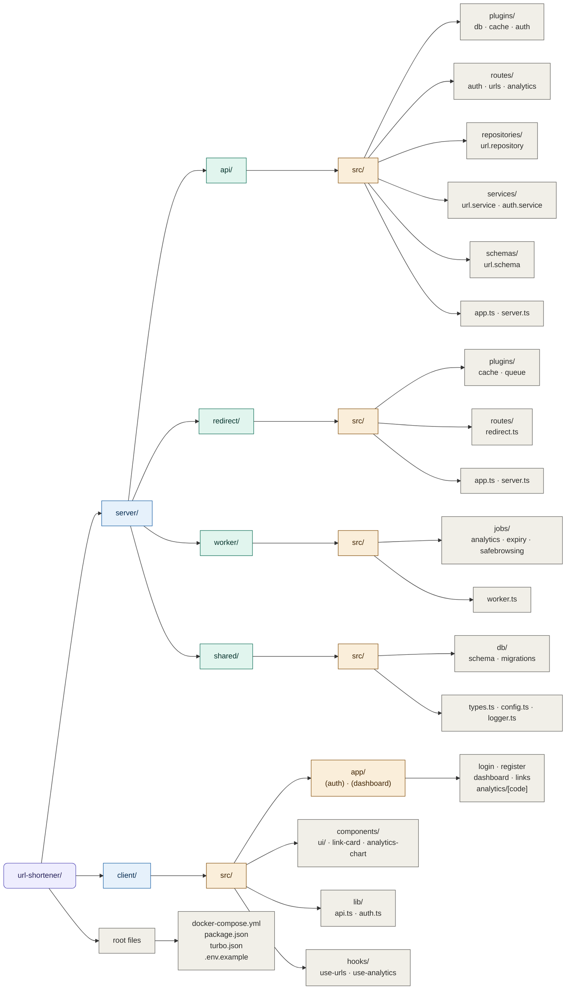
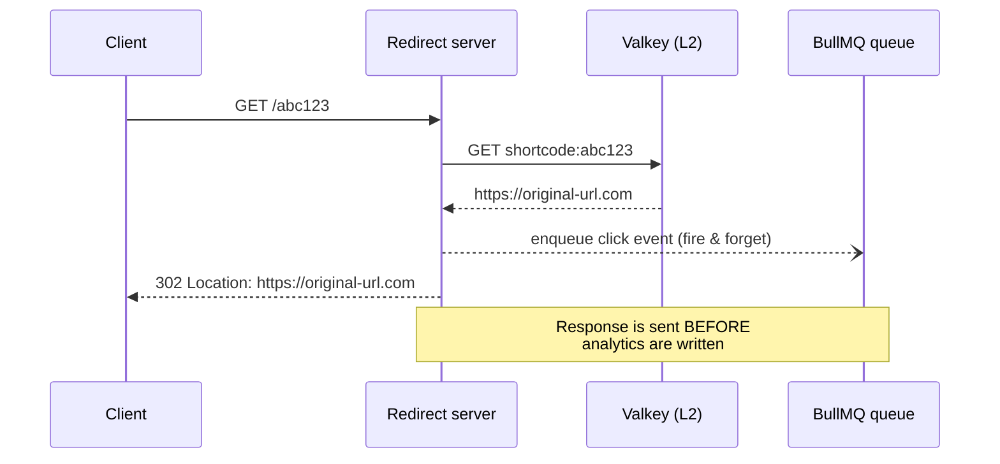
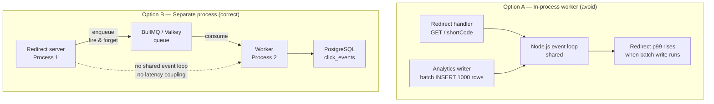
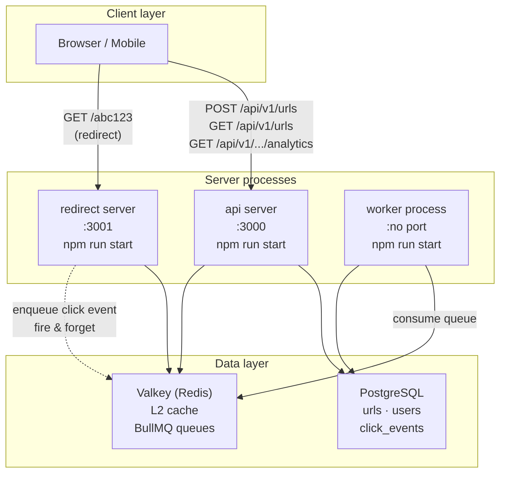

# URL Shortener — Project Structure

> Complete folder structure with architecture decisions for the monorepo: two independent Fastify backends, a separate BullMQ worker process, a Next.js frontend, and a shared internal package.

---

## Project Layout

```
url-shortener/
├── server/
│   ├── api/             # Fastify — URL management & auth API
│   ├── redirect/        # Fastify — high-speed redirect server
│   ├── worker/          # BullMQ worker — analytics, expiry, safe browsing
│   └── shared/          # Internal npm workspace package (types, schema, config)
├── client/              # Next.js frontend dashboard
├── docker-compose.yml
├── package.json         # npm workspaces root
```

---

## Directory Tree — Mermaid



---

## Backend — `/server/api` (Fastify API)

Handles URL management, auth, and analytics queries. Low-traffic write path.

```
server/api/
├── src/
│   ├── plugins/
│   │   ├── db.ts             # Prisma + PostgreSQL connection pool
│   │   ├── cache.ts          # Valkey (Redis) plugin
│   │   └── auth.ts           # JWT verify hook, fastify-jwt
│   ├── routes/
│   │   ├── auth.ts           # POST /api/v1/auth/{register,login,refresh,logout}
│   │   ├── urls.ts           # CRUD /api/v1/urls
│   │   └── analytics.ts      # GET /api/v1/urls/:code/analytics/*
│   ├── repositories/
│   │   └── url.repository.ts # DB access layer; all Prisma calls for a given resource
│   ├── services/
│   │   ├── url.service.ts    # Short code generation (Base62 counter), cache-aside
│   │   └── auth.service.ts   # bcrypt, JWT signing, refresh token DB ops
│   ├── schemas/
│   │   └── url.schema.ts     # Zod / JSON Schema for request validation
│   ├── app.ts                # Fastify instance, plugin registration
│   └── server.ts             # Port binding, graceful shutdown (SIGTERM)
├── package.json
└── tsconfig.json
```

---

## Backend — `/server/redirect` (Fastify Redirect)

The ultra-hot path. Serves `GET /:shortCode` → 302. Must stay under 10ms p99.

```
server/redirect/
├── src/
│   ├── plugins/
│   │   ├── cache.ts          # Valkey plugin — L2 cache for short codes
│   │   └── queue.ts          # BullMQ producer — fires click events, never awaited
│   ├── routes/
│   │   └── redirect.ts       # GET /:shortCode → cache hit → 302, or DB miss → cache fill → 302
│   ├── app.ts
│   └── server.ts             # Separate port (e.g. 3001), own graceful shutdown
├── package.json
└── tsconfig.json
```

**Critical path for a redirect (cache hit):**



---

## Backend — `/server/worker` (BullMQ Worker — Separate Process)

Consumes queued events from the redirect server. Zero impact on redirect latency.

```
server/worker/
├── src/
│   ├── jobs/
│   │   ├── analytics.job.ts      # Consumes click events → batch INSERT into click_events
│   │   ├── expiry.job.ts         # Cron: mark expired URLs as inactive, DEL from Valkey
│   │   └── safebrowsing.job.ts   # Async Safe Browsing API check after URL creation
│   └── worker.ts                 # BullMQ Worker init, job registration, graceful shutdown
├── package.json
└── tsconfig.json
```

### Why a Separate Process? (Not In-Process)



| Concern | In-process | Separate process |
|---|---|---|
| Redirect latency isolation | No — shared event loop | Yes — fully decoupled |
| Worker crash affects redirects | Yes | No |
| Independent scaling | No | Yes |
| Memory isolation | No | Yes |
| Dev simplicity | Slightly easier | One extra `npm run dev` |

**Verdict:** Always run the worker as a separate process. In local dev you can start all three with `turbo dev` running concurrently.

---

## Shared Internal Package — `/server/shared`

An npm workspace package consumed by `api`, `redirect`, and `worker`. Never published to npm.

```
server/shared/
├── src/
│   ├── config.ts              # getCommonConfig() — DATABASE_URL, VALKEY_URL, NODE_ENV parsed with zod
│   ├── logger.ts              # getFastifyLoggerConfig(env) — pino options for Fastify logger
│   ├── rateLimitCheck.ts      # Fixed-window rate limiter (INCR + EXPIRE)
│   └── index.ts               # Public exports
├── package.json               # name: "@url-shortener/shared", deps: zod
└── tsconfig.json
```

**config.ts** exports `getCommonConfig()` — a function (not a static object) that parses the three env vars shared by all processes. Using a function ensures dotenv has run before process.env is read. Zod defaults keep dev working without a `.env` file; zod validation surfaces bad values at startup with clear messages.

**logger.ts** exports `getFastifyLoggerConfig(env)` — returns the pino config object passed to `Fastify({ logger: ... })`. No pino import needed; Fastify constructs the instance. A standalone `createLogger()` factory for the worker process is deferred until the worker is implemented.

**Planned additions (not yet implemented):**
- `types.ts` — shared TypeScript interfaces (UrlRecord, ClickEvent, etc.) — add when worker is built
- `db/` — Drizzle schema + migrations — deferred (project currently uses Prisma per-server)

All three backends reference it as:
```json
{
  "dependencies": {
    "@url-shortener/shared": "workspace:*"
  }
}
```

---

## Frontend — `/client` (Next.js)

Dashboard for URL management and analytics. Talks only to the API server, never directly to the redirect server.

```
client/
├── src/
│   ├── app/                              # Next.js App Router
│   │   ├── (auth)/
│   │   │   ├── login/page.tsx
│   │   │   └── register/page.tsx
│   │   ├── (dashboard)/
│   │   │   ├── dashboard/page.tsx        # Overview stats
│   │   │   ├── links/page.tsx            # URL list with pagination
│   │   │   └── analytics/[code]/page.tsx # Per-link analytics charts
│   │   └── layout.tsx
│   ├── components/
│   │   ├── ui/                           # shadcn/ui primitives
│   │   ├── link-card.tsx
│   │   └── analytics-chart.tsx           # Recharts wrapper
│   ├── lib/
│   │   ├── api.ts                        # Typed fetch wrapper (access token + refresh logic)
│   │   └── auth.ts                       # next-auth or custom session helpers
│   └── hooks/
│       ├── use-urls.ts                   # SWR / React Query for URL list
│       └── use-analytics.ts
├── package.json
└── next.config.ts
```

---

## Process Architecture



---

## npm Workspaces Root

```json
{
  "name": "url-shortener",
  "private": true,
  "workspaces": [
    "server/api",
    "server/redirect",
    "server/worker",
    "server/shared",
    "client"
  ],
  "scripts": {
    "dev": "turbo run dev",
    "build": "turbo run build",
    "db:migrate": "drizzle-kit migrate"
  }
}
```

`turbo.json` runs all `dev` scripts concurrently with correct dependency order (`shared` builds first).

---

## Docker Compose (Local Dev)

```yaml
services:
  postgres:
    image: postgres:16-alpine
    environment:
      POSTGRES_DB: urlshortener
      POSTGRES_USER: dev
      POSTGRES_PASSWORD: dev
    ports: ["5432:5432"]

  valkey:
    image: valkey/valkey:7-alpine
    ports: ["6379:6379"]

  api:
    build: ./server/api
    ports: ["3000:3000"]
    depends_on: [postgres, valkey]

  redirect:
    build: ./server/redirect
    ports: ["3001:3001"]
    depends_on: [valkey]

  worker:
    build: ./server/worker
    depends_on: [postgres, valkey]

  client:
    build: ./client
    ports: ["3002:3002"]
    depends_on: [api]
```

---

*Structure follows the system design doc: redirect and API are independently deployable, the worker is always a separate process, and the shared package is the single source of truth for DB schema and types.*
