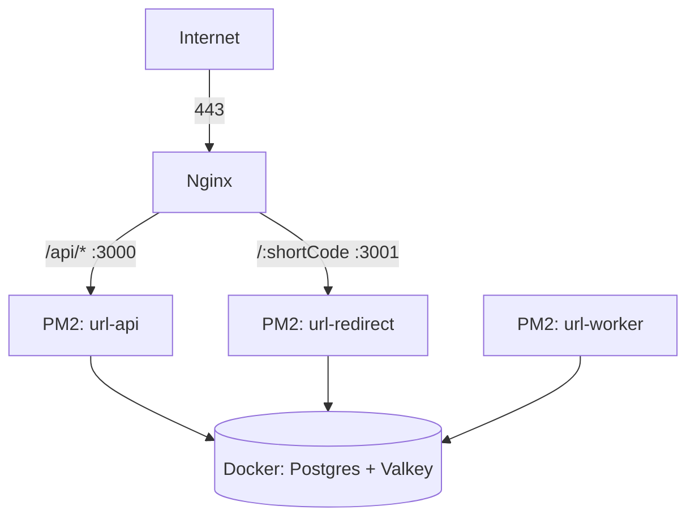
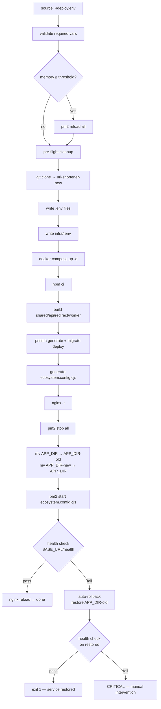
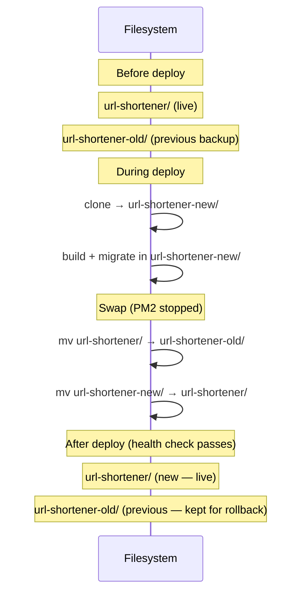
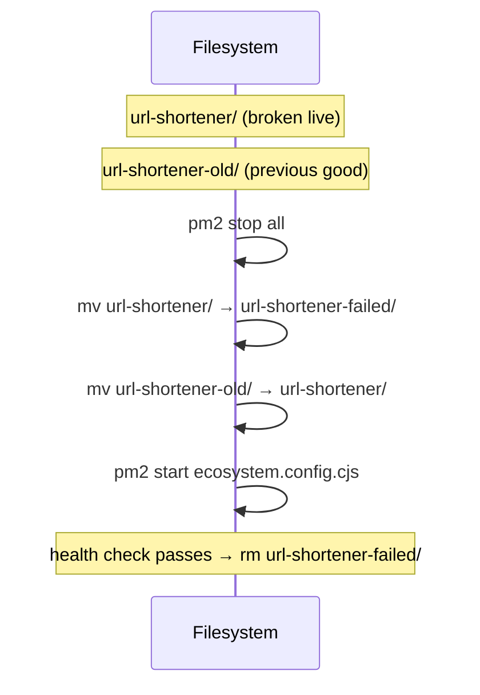

# infra/ — Deployment Infrastructure

Scripts and configuration for deploying Linkly to a single EC2 instance using a blue-green swap strategy.

---

## What This Folder Is

| File                   | Purpose                                                                  |
| ---------------------- | ------------------------------------------------------------------------ |
| `deploy.sh`            | Full blue-green deploy: clone → build → migrate → swap → health check    |
| `rollback.sh`          | Manual rollback to the previous deploy                                   |
| `deploy.env.example`   | Template for `~/deploy.env` on the EC2 instance                          |
| `ecosystem.config.cjs` | PM2 app definitions (reference copy — deploy.sh generates the live copy) |
| `README.md`            | This file                                                                |

---

## What Runs Where

| Component                 | Runs on      | Managed by           |
| ------------------------- | ------------ | -------------------- |
| API server (`:3000`)      | EC2          | PM2 (`url-api`)      |
| Redirect server (`:3001`) | EC2          | PM2 (`url-redirect`) |
| BullMQ worker             | EC2          | PM2 (`url-worker`)   |
| PostgreSQL (`:5432`)      | EC2 (Docker) | Docker Compose       |
| Valkey (`:6379`)          | EC2 (Docker) | Docker Compose       |
| Next.js client            | Vercel       | Vercel               |

---

## Runtime Architecture



---

## Deploy Flow



---

## Blue-Green Swap



---

## Rollback

### Automatic (triggered by deploy.sh on health check failure)

deploy.sh detects the failed health check, swaps back to `url-shortener-old`, restarts PM2, and re-runs the health check. The failed deploy is preserved at `url-shortener-failed/` for inspection, then deleted on success.

### Manual

```bash
bash ~/url-shortener/infra/rollback.sh
```



---

## EC2 Prerequisites (One-Time Setup)

### 1. Provision EC2

Recommended: Amazon Linux 2023, t3.small or larger.

```bash
# Node.js 22 via nvm
curl -o- https://raw.githubusercontent.com/nvm-sh/nvm/v0.39.7/install.sh | bash
source ~/.bashrc
nvm install 22
nvm use 22
nvm alias default 22

# PM2
npm install -g pm2
pm2 startup   # follow the printed command to enable PM2 on boot

# Docker
sudo yum install -y docker
sudo systemctl enable --now docker
sudo usermod -aG docker ec2-user
# Log out and back in for the group change to take effect

# Docker Compose plugin
sudo mkdir -p /usr/local/lib/docker/cli-plugins
sudo curl -SL https://github.com/docker/compose/releases/latest/download/docker-compose-linux-x86_64 \
  -o /usr/local/lib/docker/cli-plugins/docker-compose
sudo chmod +x /usr/local/lib/docker/cli-plugins/docker-compose

# Nginx
sudo yum install -y nginx
sudo systemctl enable --now nginx
```

### 2. SSH Key Setup (EC2 → GitHub)

```bash
# On EC2
ssh-keygen -t ed25519 -C "ec2-deploy" -f ~/.ssh/id_ed25519 -N ""
cat ~/.ssh/id_ed25519.pub
# Add the printed public key to GitHub → Settings → Deploy keys (read-only)

# Test
ssh -T git@github.com
```

### 3. Nginx Config

Create `/etc/nginx/conf.d/url-shortener.conf`:

```nginx
server {
    listen 80;
    server_name api.example.com;
    return 301 https://$host$request_uri;
}

# Tiered timeout budget (DECISIONS.md #24): nginx is the outermost backstop.
# App sends its own 504 envelope + Retry-After first; these only fire if the
# app is fully hung. proxy_read_timeout must stay ABOVE the Prisma query timeout.
proxy_connect_timeout 5s;
proxy_send_timeout    15s;
proxy_read_timeout    15s;

server {
    listen 443 ssl;
    server_name api.example.com;

    ssl_certificate     /etc/letsencrypt/live/api.example.com/fullchain.pem;
    ssl_certificate_key /etc/letsencrypt/live/api.example.com/privkey.pem;

    location / {
        proxy_pass         http://127.0.0.1:3000;
        proxy_set_header   Host $host;
        proxy_set_header   X-Forwarded-For $proxy_add_x_forwarded_for;
        proxy_set_header   X-Forwarded-Proto $scheme;
    }
}

server {
    listen 443 ssl;
    server_name go.example.com;

    ssl_certificate     /etc/letsencrypt/live/go.example.com/fullchain.pem;
    ssl_certificate_key /etc/letsencrypt/live/go.example.com/privkey.pem;

    location / {
        proxy_pass         http://127.0.0.1:3001;
        proxy_set_header   Host $host;
        proxy_set_header   X-Forwarded-For $proxy_add_x_forwarded_for;
        proxy_set_header   X-Forwarded-Proto $scheme;
    }
}
```

Test and reload:

```bash
sudo nginx -t && sudo systemctl reload nginx
```

### 4. TLS / Certbot

```bash
sudo yum install -y certbot python3-certbot-nginx
sudo certbot --nginx -d api.example.com -d go.example.com
# Certbot auto-renews via a systemd timer — verify with:
sudo systemctl status certbot-renew.timer
```

### 5. Create the infra directory

```bash
mkdir -p ~/infra
# Place docker-compose.yml there (see infra/docker-compose.yml section below)
```

---

## First Deploy

```bash
# 1. Copy deploy.env and deploy.sh to EC2
scp infra/deploy.env.example infra/deploy.sh ec2-user@<host>:~/

# 2. SSH in and fill in values
ssh ec2-user@<host>
chmod 600 ~/deploy.env
nano ~/deploy.env

# 3. Run deploy
bash ~/deploy.sh
```

Wait — the script will clone, build, migrate, swap, and health-check automatically.

---

## Subsequent Deploys

```bash
bash ~/deploy.sh
```

Or, if you prefer to run it from the cloned repo location:

```bash
bash ~/url-shortener/infra/deploy.sh
```

---

## deploy.env Variable Reference

### Required

| Variable             | Description                                                            |
| -------------------- | ---------------------------------------------------------------------- |
| `REPO_URL`           | SSH clone URL, e.g. `git@github.com:user/repo.git`                     |
| `APP_DIR`            | Absolute path to the live app dir, e.g. `/home/ec2-user/url-shortener` |
| `DEPLOY_BRANCH`      | Branch to deploy, e.g. `main`                                          |
| `POSTGRES_USER`      | PostgreSQL username                                                    |
| `POSTGRES_PASSWORD`  | PostgreSQL password                                                    |
| `POSTGRES_DB`        | PostgreSQL database name                                               |
| `VALKEY_PASSWORD`    | Valkey auth password (mirrors `--requirepass` in docker-compose.yml)   |
| `JWT_SECRET`         | Secret for signing access tokens (`openssl rand -hex 32`)              |
| `JWT_REFRESH_SECRET` | Secret for signing refresh tokens (`openssl rand -hex 32`)             |
| `IP_HASH_SECRET`     | Secret for hashing visitor IPs (`openssl rand -hex 32`)                |
| `BASE_URL`           | Public API URL, e.g. `https://api.example.com`                         |
| `REDIRECT_URL`       | Public redirect URL, e.g. `https://go.example.com`                     |
| `CLIENT_ORIGINS`     | Comma-separated CORS origins, e.g. `https://app.example.com`           |

### Optional (defaults shown)

| Variable                               | Default | Description                                                    |
| -------------------------------------- | ------- | -------------------------------------------------------------- |
| `DEFAULT_URL_TTL_DAYS`                 | `7`     | Default URL expiry in days                                     |
| `RATE_LIMIT_CREATE_LIMIT`              | `100`   | URL creation limit per window                                  |
| `RATE_LIMIT_WINDOW_SECS`               | `3600`  | URL creation rate limit window                                 |
| `RATE_LIMIT_LOGIN_LIMIT`               | `5`     | Login attempts per IP per window                               |
| `RATE_LIMIT_LOGIN_WINDOW_SECS`         | `60`    | Login per-IP window                                            |
| `RATE_LIMIT_LOGIN_ACCOUNT_LIMIT`       | `10`    | Login attempts per account per window                          |
| `RATE_LIMIT_LOGIN_ACCOUNT_WINDOW_SECS` | `900`   | Login per-account window                                       |
| `RATE_LIMIT_REGISTER_LIMIT`            | `5`     | Register attempts per IP per window                            |
| `RATE_LIMIT_REGISTER_WINDOW_SECS`      | `60`    | Register per-IP window                                         |
| `RATE_LIMIT_REDIRECT_LIMIT`            | `100`   | Redirects per IP per window                                    |
| `RATE_LIMIT_REDIRECT_WINDOW_SECS`      | `60`    | Redirect rate limit window                                     |
| `GEO_ENABLED`                          | `true`  | Enable IP geolocation                                          |
| `GEO_TIMEOUT_MS`                       | `2000`  | Geo lookup timeout                                             |
| `CLICK_BATCH_SIZE`                     | `100`   | Click count flush batch size                                   |
| `CLICK_FLUSH_MS`                       | `5000`  | Click count flush interval                                     |
| `WORKER_CONCURRENCY`                   | `10`    | BullMQ worker concurrency                                      |
| `SHUTDOWN_TIMEOUT_MS`                  | `30000` | Graceful shutdown timeout                                      |
| `HEALTH_CHECK_RETRIES`                 | `5`     | Health check attempts before rollback                          |
| `HEALTH_CHECK_INTERVAL_SECS`           | `3`     | Seconds between health check attempts                          |
| `MEMORY_RELOAD_THRESHOLD_PERCENT`      | `85`    | RAM usage % that triggers a PM2 reload before deploy continues |

---

## Memory Management

Docker (Postgres + Valkey) is usually the largest memory consumer on the box.
PM2 manages the Node processes (`url-api`, `url-redirect`, `url-worker`) but
**does not** manage the Docker containers — those are controlled by
`docker compose`.

### Inspecting memory

```bash
# Total + available RAM (Amazon Linux / any Linux)
free -h

# Same numbers, in kB, straight from the kernel
cat /proc/meminfo | head -n 3

# Current RAM usage as a percentage
awk '/MemTotal/ {t=$2} /MemAvailable/ {a=$2} END {print int((t-a)*100/t) "% used"}' /proc/meminfo

# Per-container memory (Docker usually takes the most)
docker stats --no-stream

# PM2 process memory
pm2 monit        # interactive
pm2 list         # static table with memory column
```

### Inspecting disk / storage

```bash
# Total / used / available disk for every mount
df -h

# Just the root volume
df -h /

# Docker disk usage (images, volumes, build cache)
docker system df
```

### How the threshold check works

`deploy.sh` reads `MEMORY_RELOAD_THRESHOLD_PERCENT` (default `85`) and, before
starting the deploy, compares it against `(MemTotal - MemAvailable) / MemTotal`.
If usage is at/above the threshold it runs `pm2 reload all` (zero-downtime) to
release RAM. If memory is _still_ above the threshold after the reload, the
script prints a warning and suggests manually restarting the Docker containers
or upgrading the instance — it does **not** abort the deploy.

### Choosing a threshold

| Instance    | RAM   | Suggested threshold |
| ----------- | ----- | ------------------- |
| `t3.micro`  | 1 GB  | `75`                |
| `t3.small`  | 2 GB  | `85` (default)      |
| `t3.medium` | 4 GB  | `90`                |
| `t3.large`+ | 8 GB+ | `90`                |

Leave headroom for the build step (`npm ci` + `tsc`) which spikes RAM briefly.

### reload vs restart vs stop/delete

| Action        | When to use                                                                                                                                       |
| ------------- | ------------------------------------------------------------------------------------------------------------------------------------------------- |
| `pm2 reload`  | **Preferred.** Zero-downtime graceful reload — new process starts, old one is killed after draining. Use for routine memory pressure and deploys. |
| `pm2 restart` | Use when `reload` fails or a process is stuck. Brief downtime (process killed then restarted).                                                    |
| `pm2 stop`    | Use during blue-green swap (current `deploy.sh` step 12). Process is stopped but kept in PM2's list.                                              |
| `pm2 delete`  | Avoid in deployment. Removes the process from PM2's saved list entirely — you'd need `pm2 start ecosystem.config.cjs` again to re-add it.         |

For Docker containers, prefer `docker compose restart` (keeps containers/volumes)
over `docker compose down` (stops + removes containers, keeps named volumes) or
`docker compose down -v` (**deletes data volumes** — never use in production).

---

## EC2 Filesystem at Steady State

```
/home/ec2-user/
├── deploy.sh                   ← standalone entry point, kept fresh by deploy.sh
├── deploy.env                  ← secrets (never committed, chmod 600)
├── deploy.env.example          ← reference template, safe to keep
├── infra/
│   ├── docker-compose.yml      ← manually maintained on EC2
│   └── .env                    ← written by deploy.sh from deploy.env
├── url-shortener/              ← live app (APP_DIR)
│   ├── server/
│   │   ├── api/dist/
│   │   ├── redirect/dist/
│   │   └── worker/dist/
│   ├── ecosystem.config.cjs    ← generated by deploy.sh
│   └── logs/
└── url-shortener-old/          ← previous deploy (kept for rollback)
```

During a deploy, `url-shortener-new/` also exists briefly until the swap.

---

## Disk Management

| Directory               | When deleted                                                                |
| ----------------------- | --------------------------------------------------------------------------- |
| `url-shortener-new/`    | On build/migration failure, or at start of next deploy (pre-flight cleanup) |
| `url-shortener-old/`    | At start of next successful deploy (pre-flight cleanup)                     |
| `url-shortener-failed/` | After successful auto-rollback or manual rollback health check passes       |

At any point, at most two full copies of the app exist on disk simultaneously.

---

## infra/docker-compose.yml

The `~/infra/docker-compose.yml` on EC2 is maintained manually (not deployed from the repo). It manages PostgreSQL and Valkey. It reads credentials from `~/infra/.env`, which deploy.sh writes on every deploy.

Minimal example:

```yaml
version: "3.8"
services:
  postgres:
    image: postgres:15
    environment:
      POSTGRES_USER: ${POSTGRES_USER}
      POSTGRES_PASSWORD: ${POSTGRES_PASSWORD}
      POSTGRES_DB: ${POSTGRES_DB}
    ports:
      - "127.0.0.1:5432:5432"
    volumes:
      - postgres_data:/var/lib/postgresql/data

  valkey:
    image: valkey/valkey:7
    command: ["valkey-server", "--requirepass", "${VALKEY_PASSWORD}"]
    ports:
      - "127.0.0.1:6379:6379"
    volumes:
      - valkey_data:/data

volumes:
  postgres_data:
  valkey_data:
```

To update the compose config: edit the file on EC2 directly, then run `docker compose --project-directory ~/infra --env-file ~/infra/.env up -d`.

---

## Common Failure Cases

| Symptom                                       | Cause                                                 | Fix                                                                         |
| --------------------------------------------- | ----------------------------------------------------- | --------------------------------------------------------------------------- |
| `git clone failed`                            | SSH key not added to GitHub deploy keys               | `cat ~/.ssh/id_ed25519.pub` → add to GitHub repo → Settings → Deploy keys   |
| `Missing required environment variable`       | `~/deploy.env` incomplete                             | `nano ~/deploy.env` and fill in the missing variable                        |
| `Migration failed`                            | DB not running, or migration conflict                 | `docker compose --project-directory ~/infra up -d`; check migration history |
| `Nginx config invalid`                        | Syntax error in `/etc/nginx/conf.d/`                  | `sudo nginx -t` shows the line; fix and re-run deploy                       |
| `Health check failed — auto-rollback`         | New code crashes on startup                           | Check `pm2 logs url-api`; inspect `url-shortener-failed/`                   |
| `CRITICAL: Rollback health check also failed` | Old code also broken (e.g. bad migration)             | `pm2 logs`; may need to restore DB from backup                              |
| `docker: permission denied`                   | ec2-user not in docker group                          | `sudo usermod -aG docker ec2-user` then log out/in                          |
| `pm2: command not found`                      | PM2 not installed or not on PATH                      | `npm install -g pm2`; check `~/.bashrc` for nvm PATH                        |
| `Memory still above threshold after reload`   | Docker containers or other OS processes consuming RAM | `docker stats`; `docker compose restart`; consider larger instance          |
