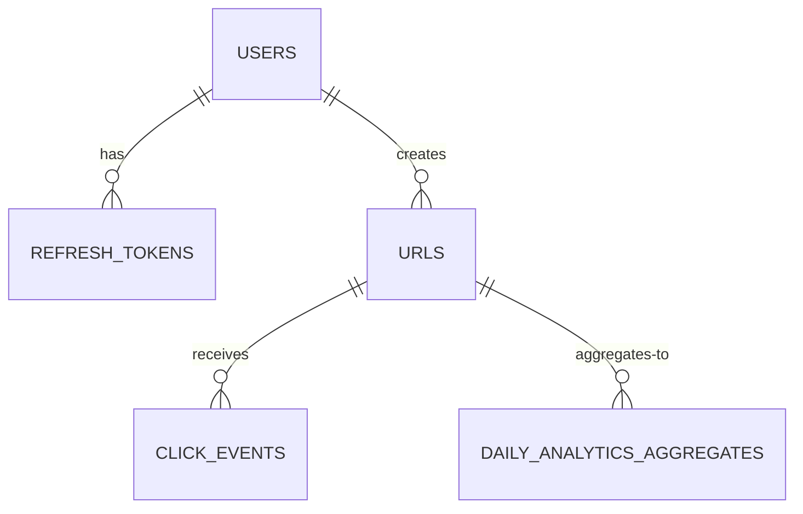
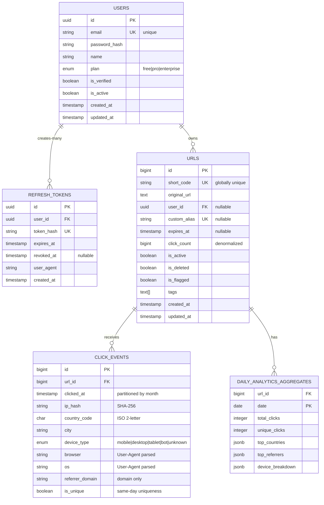

# URL Shortener — Database Schema & Entity Relationship Diagram

> **Purpose:** Complete database design for a production-grade URL shortener system with entity relationships, column definitions, constraints, and optimization notes.

---

## Table of Contents

1. [Entity Relationship Diagram (ERD)](#entity-relationship-diagram-erd)
2. [Detailed Schema Design](#detailed-schema-design)
3. [Relationships & Constraints](#relationships--constraints)
4. [Indexing Strategy](#indexing-strategy)
5. [Schema Optimization Notes](#schema-optimization-notes)

---

## Entity Relationship Diagram (ERD)

### High-Level Relationship View



---

### Detailed ER Diagram with Columns



---

## Detailed Schema Design

### 1. USERS Table

**Purpose:** Store user accounts, credentials, and subscription tier information.

| Column | Type | Constraints | Purpose |
|---|---|---|---|
| `id` | UUID | PK, NOT NULL | Primary identifier. UUID prevents ID enumeration attacks. |
| `email` | VARCHAR(255) | UNIQUE, NOT NULL | Login identifier. Case-insensitive unique constraint recommended. |
| `password_hash` | VARCHAR(255) | NOT NULL | Argon2id hash. Never store plaintext passwords. Never use bcrypt (GPU-vulnerable). |
| `name` | VARCHAR(100) | NOT NULL | User's display name. |
| `plan` | ENUM | NOT NULL, DEFAULT 'free' | `'free'`, `'pro'`, `'enterprise'`. Used for rate limit tiers and feature gating. |
| `is_verified` | BOOLEAN | NOT NULL, DEFAULT false | Email verification gate. Unverified users can't create URLs. |
| `is_active` | BOOLEAN | NOT NULL, DEFAULT true | Soft disable. False = account suspended, no API access. |
| `created_at` | TIMESTAMPTZ | NOT NULL, DEFAULT NOW() | Timezone-aware creation timestamp. Always store in UTC. |
| `updated_at` | TIMESTAMPTZ | NOT NULL, DEFAULT NOW() | Auto-updated via trigger on modification. |

**Indexes:**
```sql
CREATE UNIQUE INDEX idx_users_email ON users(LOWER(email));
-- Case-insensitive for login lookup

CREATE INDEX idx_users_plan ON users(plan);
-- For rate limit tier queries (list all pro users)

CREATE INDEX idx_users_created_at ON users(created_at DESC);
-- For admin dashboards (newest users)
```

**Trigger:**
```sql
CREATE TRIGGER update_users_updated_at
  BEFORE UPDATE ON users
  FOR EACH ROW
  EXECUTE FUNCTION update_timestamp();
```

---

### 2. REFRESH_TOKENS Table

**Purpose:** Store issued refresh tokens for stateful revocation and session management.

| Column | Type | Constraints | Purpose |
|---|---|---|---|
| `id` | UUID | PK, NOT NULL | Token ID for tracking. |
| `user_id` | UUID | FK (users.id), NOT NULL | Owner of this token. |
| `token_hash` | VARCHAR(64) | UNIQUE, NOT NULL | SHA-256 hash of the opaque token string. Never store raw token. |
| `expires_at` | TIMESTAMPTZ | NOT NULL | TTL. Default = NOW() + 30 days. |
| `revoked_at` | TIMESTAMPTZ | NULLABLE | NULL if active; set on logout. Enables "revoke all sessions" by setting all revoked_at. |
| `user_agent` | VARCHAR(500) | NOT NULL | Which device/browser issued this token (for "active sessions" view). |
| `created_at` | TIMESTAMPTZ | NOT NULL, DEFAULT NOW() | When token was issued. |

**Why a separate table instead of pure JWT?**
- **Revocation:** JWTs are stateless; pure JWT tokens can't be revoked until expiry. This table enables true revocation (logout, security compromise, multi-device session management).
- **Session visibility:** Users can see all active devices in their account dashboard.
- **Token rotation:** Invalidate old tokens after refresh, detect token theft via duplicate rotation.

**Indexes:**
```sql
CREATE UNIQUE INDEX idx_refresh_tokens_hash ON refresh_tokens(token_hash);
-- For token validation lookup (most frequent query)

CREATE INDEX idx_refresh_tokens_user_id ON refresh_tokens(user_id, revoked_at)
  WHERE revoked_at IS NULL;
-- For "list active sessions for user" — partial index (only non-revoked)

CREATE INDEX idx_refresh_tokens_expires_at ON refresh_tokens(expires_at)
  WHERE revoked_at IS NULL;
-- For cleanup job: find expired, non-revoked tokens to purge
```

---

### 3. URLS Table

**Purpose:** Store shortened URLs, metadata, and denormalized counters.

| Column | Type | Constraints | Purpose |
|---|---|---|---|
| `id` | BIGSERIAL | PK, NOT NULL | Auto-incrementing sequence. Input to Base62 encoding. |
| `short_code` | VARCHAR(12) | UNIQUE, NOT NULL | Base62-encoded `id` or custom alias. The redirectable identifier. |
| `original_url` | TEXT | NOT NULL | The destination URL. TEXT not VARCHAR — URLs can exceed 255 chars. |
| `user_id` | UUID | FK (users.id), NULLABLE | Owner. NULL for anonymous links (future feature). |
| `custom_alias` | VARCHAR(50) | UNIQUE, NULLABLE | User-provided custom shortCode. e.g., `sale2024`. |
| `expires_at` | TIMESTAMPTZ | NULLABLE | Expiry datetime. NULL = never expires. Checked lazily on redirect. |
| `click_count` | BIGINT | NOT NULL, DEFAULT 0 | Denormalized counter. Updated asynchronously from click events. |
| `is_active` | BOOLEAN | NOT NULL, DEFAULT true | Soft disable. False = redirect returns 410. |
| `is_deleted` | BOOLEAN | NOT NULL, DEFAULT false | Soft delete. False = still active; True = effectively deleted. |
| `is_flagged` | BOOLEAN | NOT NULL, DEFAULT false | Malicious URL flag (from Safe Browsing API check). Redirect returns 451 if true. |
| `tags` | TEXT[] | NULLABLE | PostgreSQL native array for user-defined labels. |
| `created_at` | TIMESTAMPTZ | NOT NULL, DEFAULT NOW() | Creation timestamp. |
| `updated_at` | TIMESTAMPTZ | NOT NULL, DEFAULT NOW() | Last modification. |

**Indexes:**
```sql
-- PRIMARY INDEX: Every redirect query uses this
CREATE UNIQUE INDEX idx_urls_short_code ON urls(short_code);
-- Critical for performance: /:shortCode GET requests

-- USER-SCOPED QUERIES: List all URLs for a user
CREATE INDEX idx_urls_user_created ON urls(user_id, created_at DESC)
  WHERE is_deleted = false;
-- Enables: SELECT * FROM urls WHERE user_id = ? AND is_deleted = false ORDER BY created_at DESC LIMIT 20

-- EXPIRY CLEANUP: Background job finds URLs to expire
CREATE INDEX idx_urls_expires_at ON urls(expires_at)
  WHERE is_deleted = false AND expires_at IS NOT NULL AND expires_at < NOW();
-- Partial index: only considers non-deleted, unexpired URLs

-- ANALYTICS: Aggregate click counts across user URLs
CREATE INDEX idx_urls_user_is_deleted ON urls(user_id, is_deleted)
  WHERE user_id IS NOT NULL;

-- SEARCH: Full-text search on original_url and custom_alias
CREATE INDEX idx_urls_original_url ON urls USING GIN (to_tsvector('english', original_url));
-- Optional: for full-text search (advanced feature)
```

**Sequence for ID:**
```sql
CREATE SEQUENCE urls_id_seq
  START 1
  INCREMENT 1
  CACHE 1000;
-- CACHE 1000: Pre-allocate IDs in memory to reduce sequence table hits
```

---

### 4. CLICK_EVENTS Table

**Purpose:** Store granular click events for analytics with eventual consistency.

| Column | Type | Constraints | Purpose |
|---|---|---|---|
| `id` | BIGSERIAL | PK, NOT NULL | Event ID. Used for ordering. |
| `url_id` | BIGINT | FK (urls.id), NOT NULL | Which URL was clicked. Denormalized: also carries user_id context if needed. |
| `clicked_at` | TIMESTAMPTZ | NOT NULL | When the click occurred. Partitioning key. |
| `ip_hash` | VARCHAR(64) | NOT NULL | SHA-256(IP + daily_salt). Daily salt ensures: (1) unhashable after 24h (privacy), (2) uniqueness detection is same-day. Never store raw IPs. |
| `country_code` | CHAR(2) | NULLABLE | ISO 3166-1 alpha-2 code from IP geolocation. |
| `city` | VARCHAR(100) | NULLABLE | City from IP geolocation. |
| `device_type` | ENUM | NOT NULL | `'mobile'`, `'desktop'`, `'tablet'`, `'bot'`, `'unknown'` — parsed from User-Agent. |
| `browser` | VARCHAR(50) | NULLABLE | Browser name from User-Agent. e.g., `'Chrome'`, `'Safari'`. |
| `os` | VARCHAR(50) | NULLABLE | Operating system from User-Agent. e.g., `'Windows'`, `'iOS'`. |
| `referrer_domain` | VARCHAR(255) | NULLABLE | Domain-only referrer (no path). e.g., `'twitter.com'` from `'https://twitter.com/user/status/123'`. Path not stored — may contain PII. |
| `is_unique` | BOOLEAN | NOT NULL | True if this is the first click from `ip_hash` for this `url_id` on `clicked_at::DATE`. Enables unique visitor counting. |

**Why NOT synchronous writes?**
At 115,000 clicks/second, writing one row per click to PostgreSQL synchronously would:
- Block the redirect handler (add 5-10ms latency per click)
- Overwhelm the database connection pool
- Create a hard scalability ceiling

**Solution:** Asynchronous pipeline:
1. Redirect handler publishes click event to BullMQ queue (non-blocking, <1ms)
2. Returns 302 immediately
3. Worker processes queue, inserts batch into DB

**Partitioning Strategy:**
```sql
CREATE TABLE click_events (
  id BIGSERIAL,
  url_id BIGINT NOT NULL,
  clicked_at TIMESTAMPTZ NOT NULL,
  -- ... other columns
  PRIMARY KEY (id, clicked_at)
) PARTITION BY RANGE (DATE_TRUNC('month', clicked_at));

-- Monthly partitions automatically created:
CREATE TABLE click_events_2024_01 PARTITION OF click_events
  FOR VALUES FROM ('2024-01-01') TO ('2024-02-01');
-- Repeat for each month

-- BENEFITS:
-- - Query for "last 30 days" scans only 1-2 partitions (not entire table)
-- - Archive old partitions: ALTER TABLE click_events DETACH PARTITION click_events_2023_01;
-- - Drop old data: DROP TABLE click_events_2023_01; (instant, vs expensive DELETE)
```

**Indexes (on each partition):**
```sql
-- Lookup: all clicks for one URL in a date range
CREATE INDEX idx_click_events_url_clicked ON click_events(url_id, clicked_at DESC);

-- Geolocation aggregation
CREATE INDEX idx_click_events_country ON click_events(url_id, country_code, clicked_at);

-- Referrer analysis
CREATE INDEX idx_click_events_referrer ON click_events(url_id, referrer_domain, clicked_at);

-- Device breakdown
CREATE INDEX idx_click_events_device ON click_events(url_id, device_type, clicked_at);
```

**Retention Policy:**
```
- Keep full click_events (raw rows) for 90 days
- Daily aggregation job (runs at 00:05 UTC) computes summaries
- Archive old partitions: DETACH after 90 days, store on cold storage
- Long-term analysis: query daily_analytics_aggregates, not raw events
```

---

### 5. DAILY_ANALYTICS_AGGREGATES Table

**Purpose:** Pre-aggregated analytics for fast queries without scanning millions of raw events.

| Column | Type | Constraints | Purpose |
|---|---|---|---|
| `url_id` | BIGINT | FK (urls.id), PK | Which URL. Part of composite PK. |
| `date` | DATE | PK | Which day. Part of composite PK. |
| `total_clicks` | INTEGER | NOT NULL, DEFAULT 0 | Total clicks this day (includes bot traffic). |
| `unique_clicks` | INTEGER | NOT NULL, DEFAULT 0 | Unique visitor count (based on `ip_hash` + daily salt). |
| `top_countries` | JSONB | NOT NULL, DEFAULT '{}' | Aggregated: `{"IN": 450, "US": 230, ...}`. |
| `top_referrers` | JSONB | NOT NULL, DEFAULT '{}' | Aggregated: `{"twitter.com": 120, "reddit.com": 85, ...}`. |
| `device_breakdown` | JSONB | NOT NULL, DEFAULT '{}' | Aggregated: `{"mobile": 65.2, "desktop": 31.4, "tablet": 3.4}`. |

**Why JSONB?**
- Flexible schema: new analytics dimensions added without schema migration
- Queryable: `SELECT (top_countries->>'IN')::INTEGER FROM daily_analytics_aggregates WHERE url_id = ? AND date >= NOW() - INTERVAL '30 days'`
- Compact storage: aggregated data is naturally denormalized

**Aggregation Job (Runs at 00:05 UTC):**

```sql
INSERT INTO daily_analytics_aggregates (url_id, date, total_clicks, unique_clicks, top_countries, top_referrers, device_breakdown)
SELECT
  url_id,
  DATE(clicked_at) as date,
  COUNT(*) as total_clicks,
  COUNT(DISTINCT ip_hash) as unique_clicks,
  JSONB_OBJECT_AGG(country_code, click_count)::JSONB as top_countries,
  JSONB_OBJECT_AGG(referrer_domain, click_count)::JSONB as top_referrers,
  JSONB_OBJECT_AGG(device_type, device_pct)::JSONB as device_breakdown
FROM (
  SELECT
    url_id,
    clicked_at,
    country_code,
    referrer_domain,
    device_type,
    ip_hash,
    COUNT(*) as click_count,
    ROUND(100.0 * COUNT(*) / SUM(COUNT(*)) OVER (PARTITION BY url_id, DATE(clicked_at)), 1) as device_pct
  FROM click_events
  WHERE DATE(clicked_at) = CURRENT_DATE - INTERVAL '1 day'
  GROUP BY url_id, clicked_at, country_code, referrer_domain, device_type, ip_hash
)
GROUP BY url_id, DATE(clicked_at)
ON CONFLICT (url_id, date) DO UPDATE SET
  total_clicks = EXCLUDED.total_clicks,
  unique_clicks = EXCLUDED.unique_clicks,
  top_countries = EXCLUDED.top_countries,
  top_referrers = EXCLUDED.top_referrers,
  device_breakdown = EXCLUDED.device_breakdown;
```

**Indexes:**
```sql
-- Analytics summary queries
CREATE INDEX idx_daily_analytics_url_date ON daily_analytics_aggregates(url_id, date DESC);

-- Time-series analysis
CREATE INDEX idx_daily_analytics_date ON daily_analytics_aggregates(date DESC);
```

**Query Example (Fast):**
```sql
-- Get 30-day analytics in <5ms
SELECT
  SUM(total_clicks) as clicks_30d,
  SUM(unique_clicks) as uniques_30d,
  top_countries->'IN' as india_clicks,
  top_referrers->'twitter.com' as twitter_clicks
FROM daily_analytics_aggregates
WHERE url_id = $1 AND date >= CURRENT_DATE - INTERVAL '30 days'
GROUP BY url_id;
```

---

## Relationships & Constraints

### 1. Users ← → Refresh Tokens (1:N)

**Relationship:** One user can have multiple active sessions (devices).

```sql
ALTER TABLE refresh_tokens
ADD CONSTRAINT fk_refresh_tokens_user_id
FOREIGN KEY (user_id) REFERENCES users(id)
ON DELETE CASCADE  -- Delete user → delete all refresh tokens
ON UPDATE CASCADE;
```

**Business Rules:**
- Logout: set `revoked_at = NOW()` for specific token
- Logout all devices: `UPDATE refresh_tokens SET revoked_at = NOW() WHERE user_id = ?`
- Security: if token theft detected, revoke all and force re-login on all devices

---

### 2. Users ← → URLs (1:N)

**Relationship:** One user owns many URLs.

```sql
ALTER TABLE urls
ADD CONSTRAINT fk_urls_user_id
FOREIGN KEY (user_id) REFERENCES users(id)
ON DELETE CASCADE  -- Delete user → delete all user's URLs (soft-delete alternative exists)
ON UPDATE CASCADE;
```

**Nullable:** `user_id` is nullable for future "anonymous links" feature (links not owned by anyone).

**IDOR Prevention (Critical for Security):**
```sql
-- API rule: All URL queries include ownership check
SELECT * FROM urls
  WHERE short_code = $1 AND user_id = $2;
  -- Returns NULL if URL doesn't exist OR user doesn't own it
  -- Return 404 (not 403) to prevent enumeration
```

---

### 3. URLs ← → Click Events (1:N)

**Relationship:** One URL can have millions of click events.

```sql
ALTER TABLE click_events
ADD CONSTRAINT fk_click_events_url_id
FOREIGN KEY (url_id) REFERENCES urls(id)
ON DELETE CASCADE  -- Delete URL → cascade delete clicks (or keep for analytics history)
ON UPDATE CASCADE;
```

**Cascade vs. Restrict:**
- `ON DELETE CASCADE` simplifies cleanup but loses analytics history
- `ON DELETE RESTRICT` preserves history but orphans click records if URL is hard-deleted
- **Recommendation:** Use soft-delete on URLs (set `is_deleted = true`) instead of hard delete. Keep all clicks for historical analysis.

---

### 4. URLs ← → Daily Analytics Aggregates (1:N)

**Relationship:** One URL has one aggregated row per day.

```sql
ALTER TABLE daily_analytics_aggregates
ADD CONSTRAINT fk_daily_analytics_url_id
FOREIGN KEY (url_id) REFERENCES urls(id)
ON DELETE CASCADE
ON UPDATE CASCADE;
```

**Natural PK:** `(url_id, date)` — unique combination of URL and date.

```sql
ALTER TABLE daily_analytics_aggregates
ADD CONSTRAINT pk_daily_analytics
PRIMARY KEY (url_id, date);
```

---

## Indexing Strategy

### Index Priority Matrix

| Index | Table | Selectivity | Query Frequency | Size Impact | Priority | Create? |
|---|---|---|---|---|---|---|
| `idx_urls_short_code` | urls | High (unique) | Extreme (every redirect) | Minimal | **CRITICAL** | ✅ Day 1 |
| `idx_urls_user_created` | urls | High | High (user dashboard) | Medium | **HIGH** | ✅ Day 1 |
| `idx_refresh_tokens_hash` | refresh_tokens | High (unique) | High (every login) | Small | **HIGH** | ✅ Day 1 |
| `idx_users_email` | users | High (unique) | High (registration/login) | Small | **HIGH** | ✅ Day 1 |
| `idx_click_events_url_clicked` | click_events | Medium | High (analytics) | Large | **MEDIUM** | ✅ Day 3 |
| `idx_daily_analytics_url_date` | daily_analytics_aggregates | High | High (analytics summary) | Small | **MEDIUM** | ✅ Day 5 |
| `idx_urls_expires_at` | urls | Low (partial) | Medium (cleanup job) | Small | **MEDIUM** | ✅ Day 7 |
| `idx_click_events_country` | click_events | Low | Medium (geographic analysis) | Large | **LOW** | ⏰ Later |
| `idx_users_plan` | users | Low | Low (admin queries) | Small | **LOW** | ⏰ Later |

### Index Creation Statements

**Day 1 — Critical Path:**
```sql
-- Redirects
CREATE UNIQUE INDEX idx_urls_short_code ON urls(short_code);

-- User management
CREATE UNIQUE INDEX idx_users_email ON users(LOWER(email));
CREATE UNIQUE INDEX idx_refresh_tokens_hash ON refresh_tokens(token_hash);

-- User dashboard
CREATE INDEX idx_urls_user_created ON urls(user_id, created_at DESC)
  WHERE is_deleted = false;
```

**Day 3 — Analytics Foundation:**
```sql
-- Click event lookup
CREATE INDEX idx_click_events_url_clicked ON click_events(url_id, clicked_at DESC);

-- Aggregated analytics
CREATE INDEX idx_daily_analytics_url_date ON daily_analytics_aggregates(url_id, date DESC);
```

**Day 7 — Operational:**
```sql
-- Expiry cleanup job
CREATE INDEX idx_urls_expires_at ON urls(expires_at)
  WHERE is_deleted = false AND expires_at IS NOT NULL;

-- Token cleanup
CREATE INDEX idx_refresh_tokens_expires_at ON refresh_tokens(expires_at)
  WHERE revoked_at IS NULL;
```

**Optional — Advanced Analytics:**
```sql
-- Geographic analysis
CREATE INDEX idx_click_events_country ON click_events(url_id, country_code, clicked_at);

-- Referrer analysis
CREATE INDEX idx_click_events_referrer ON click_events(url_id, referrer_domain, clicked_at);

-- Device analysis
CREATE INDEX idx_click_events_device ON click_events(url_id, device_type, clicked_at);
```

---

## Schema Optimization Notes

### 1. Denormalization: `urls.click_count`

**Why denormalize?**
Querying `COUNT(*) FROM click_events WHERE url_id = ?` for every URL in a user's dashboard (20 URLs) means 20 full-table scans during peak analytics hours.

**Better approach:**
- Denormalized counter `urls.click_count`
- Updated asynchronously: after batch-inserting click events, `UPDATE urls SET click_count = click_count + batch_size WHERE id IN (...)`
- Trade-off: stale by up to batch processing delay (typically <5 seconds)

**ACID concern:** The counter is eventually consistent, not transactionally accurate. For a URL shortener, this is acceptable (analytics aren't financial data).

---

### 2. IP Hashing: `click_events.ip_hash`

**Why hash?**
- Raw IPs are PII → GDPR/privacy liability
- Storing raw IPs exposes them to data breaches
- Can't un-store an IP once compromised

**Salt rotation (daily):**
```sql
-- Generate salt once per day (part of application setup)
ip_hash = SHA256(raw_ip + date_based_salt)

-- Effect:
-- - Same IP, different day → different hash (can't track users across days)
-- - Same IP, same day → same hash (unique visitor detection works)
-- - After 24h, can't recover the original IP even with the hash
```

---

### 3. Soft Delete vs. Hard Delete

**Soft Delete Pattern Used:**
```sql
-- Don't do this (hard delete):
DELETE FROM urls WHERE id = $1;

-- Do this (soft delete):
UPDATE urls SET is_deleted = true, updated_at = NOW() WHERE id = $1;

-- Redirect handler:
SELECT * FROM urls WHERE short_code = $1;
-- Then check: if is_deleted or is_active is false, return 410 Gone

-- Restore later:
UPDATE urls SET is_deleted = false WHERE id = $1;
```

**Benefits:**
- Preserves analytics history (click events and aggregates remain intact)
- Reversible: undo accidental deletion
- Audit trail: original timestamps preserved
- No orphaned click records

---

### 4. Composite Indexes vs. Multiple Single-Column Indexes

**Example: `idx_urls_user_created`**

```sql
-- WRONG (two separate indexes):
CREATE INDEX idx_urls_user_id ON urls(user_id);
CREATE INDEX idx_urls_created_at ON urls(created_at DESC);
-- Query planner can use only one; must filter the other in memory

-- CORRECT (composite index):
CREATE INDEX idx_urls_user_created ON urls(user_id, created_at DESC)
WHERE is_deleted = false;
-- Query planner uses both columns; supports queries like:
-- SELECT * FROM urls WHERE user_id = ? ORDER BY created_at DESC LIMIT 20
```

**When to use composite:**
- Columns are almost always queried together
- Left-to-right selectivity: first column (user_id) filters heavily, second (created_at) orders
- Otherwise, maintain separate indexes

---

### 5. Partial Indexes for Performance

**Example: Expiry Cleanup**
```sql
-- INEFFICIENT (scans all URLs):
CREATE INDEX idx_urls_expires_at ON urls(expires_at);

-- EFFICIENT (scans only eligible URLs):
CREATE INDEX idx_urls_expires_at ON urls(expires_at)
WHERE is_deleted = false AND expires_at IS NOT NULL AND expires_at < NOW();
-- Index only includes rows matching the WHERE clause
-- Much smaller index, faster lookups, faster cleanup job
```

---

### 6. JSONB vs. Separate Tables

**Used for:** `daily_analytics_aggregates.top_countries`, `top_referrers`, `device_breakdown`

**Why JSONB instead of normalization?**
- Aggregated data is naturally denormalized (summary row per day)
- New dimensions (e.g., `os_breakdown`) don't require schema migration
- Queryable: `WHERE top_countries->>'IN' = '450'`
- Compact storage: single row vs. multiple related rows

**Trade-off:** Less normalized, but appropriate for read-only analytics.

---

### 7. Partitioning Strategy for Click Events

**Why partition?**
- Table grows 115K rows/second × 86,400 seconds = 9.9 billion rows/day
- After 90 days: ~891 billion rows without partitioning
- Full-table scans become prohibitively slow

**Partitioning by month:**
```
click_events_2024_01: Jan 1–31 (~87 billion rows)
click_events_2024_02: Feb 1–28 (~79 billion rows)
...
click_events_2024_12: Dec 1–31 (~88 billion rows)
```

**Query benefits:**
```sql
-- Query: "Get analytics for last 30 days"
SELECT * FROM click_events WHERE url_id = $1 AND clicked_at > NOW() - INTERVAL '30 days'

-- Without partitioning: Full table scan (billions of rows)
-- With partitioning: Only scans 2 monthly partitions (~175 billion rows total, 10x smaller)
```

**Archive & Purge:**
```sql
-- After 90 days, archive the partition:
ALTER TABLE click_events DETACH PARTITION click_events_2023_10;
-- Upload to cold storage (S3, archive DB)

-- Drop old partition (instant, vs DELETE which is slow):
DROP TABLE click_events_2023_10;
```

---

## Summary: Schema at a Glance

```
┌─────────────────────────────────────────────────────────────────┐
│ USERS (5K–100K rows expected)                                   │
│ - id (UUID) [PK]                                                │
│ - email [UNIQUE INDEX] ← Login lookup                           │
│ - password_hash                                                 │
│ - plan [INDEX] ← Rate limit tier queries                        │
├─────────────────────────────────────────────────────────────────┤
│ REFRESH_TOKENS (5K–50K active rows)                             │
│ - id (UUID) [PK]                                                │
│ - user_id [FK → users] ← Session ownership                      │
│ - token_hash [UNIQUE INDEX] ← Token validation                  │
│ - revoked_at [NULLABLE] ← Revocation flag                       │
└─────────────────────────────────────────────────────────────────┘
          │ 1:N           │ 1:N
          ▼               ▼
    ┌─────────────────────────────────────────────────────────────┐
    │ URLS (100M–1B rows, grows 100K+/day)                        │
    │ - id (BIGSERIAL) [PK, source for Base62]                    │
    │ - short_code [UNIQUE INDEX] ← Every redirect hits this      │
    │ - original_url                                              │
    │ - user_id (UUID) [FK → users, NULLABLE] ← Ownership         │
    │ - custom_alias [UNIQUE, NULLABLE]                           │
    │ - click_count [denormalized counter]                        │
    │ - is_active, is_deleted, is_flagged [soft states]           │
    │ - expires_at [NULLABLE, PARTIAL INDEX]                      │
    │ - tags (TEXT array)                                         │
    └─────────────────────────────────────────────────────────────┘
          │ 1:N                     │ 1:N
          ▼                         ▼
    ┌──────────────────┐  ┌────────────────────────────────────┐
    │ CLICK_EVENTS     │  │ DAILY_ANALYTICS_AGGREGATES         │
    │ (9.9B rows/day)  │  │ (100M–1B rows, 1 per URL per day)  │
    │ [Partitioned by  │  │                                    │
    │  month]          │  │ - url_id [FK → urls, PK]           │
    │                  │  │ - date [PK]                        │
    │ - url_id [FK]    │  │ - total_clicks                     │
    │ - clicked_at     │  │ - unique_clicks                    │
    │ - ip_hash        │  │ - top_countries (JSONB)            │
    │ - country_code   │  │ - top_referrers (JSONB)            │
    │ - device_type    │  │ - device_breakdown (JSONB)         │
    │ - browser, os    │  │                                    │
    │ - referrer_domain│  │ [Generated by nightly              │
    │ - is_unique      │  │  aggregation job]                  │
    └──────────────────┘  └────────────────────────────────────┘
```

---

## Implementation Checklist

- [ ] Create `users` table with email UNIQUE index
- [ ] Create `refresh_tokens` table with token_hash UNIQUE index
- [ ] Create `urls` table with BIGSERIAL id and Base62 encoding support
- [ ] Create UNIQUE index on `urls.short_code` (CRITICAL)
- [ ] Create composite index on `urls(user_id, created_at DESC)`
- [ ] Create `click_events` table with monthly partitioning
- [ ] Create `daily_analytics_aggregates` table with (url_id, date) composite PK
- [ ] Create all foreign key constraints with appropriate ON DELETE policies
- [ ] Set up `update_timestamp()` trigger on `users` and `urls`
- [ ] Configure sequence cache on `urls_id_seq` (CACHE 1000)
- [ ] Test partitioning: create test partitions for Jan–Dec
- [ ] Verify indexes via `EXPLAIN ANALYZE` on common queries
- [ ] Document index rebuild strategy (post-large deletes)

---

*Schema version: 1.0*  
*Last updated: April 2026*
