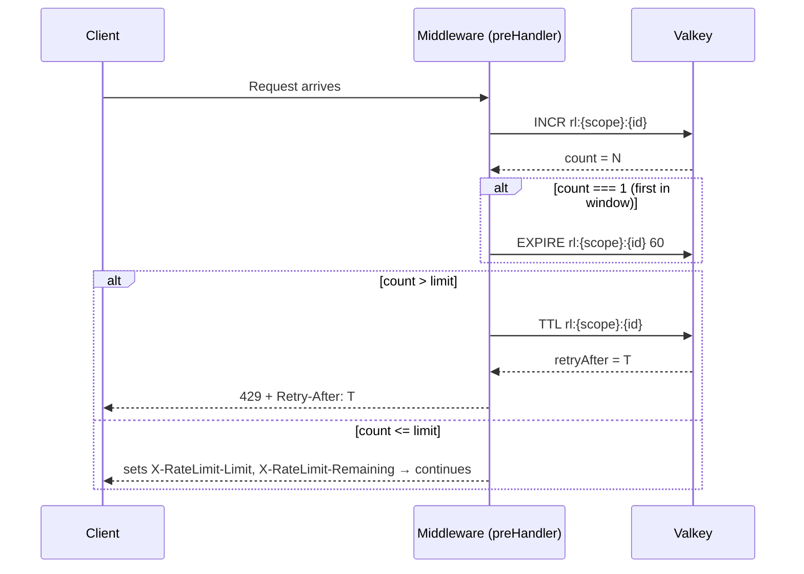
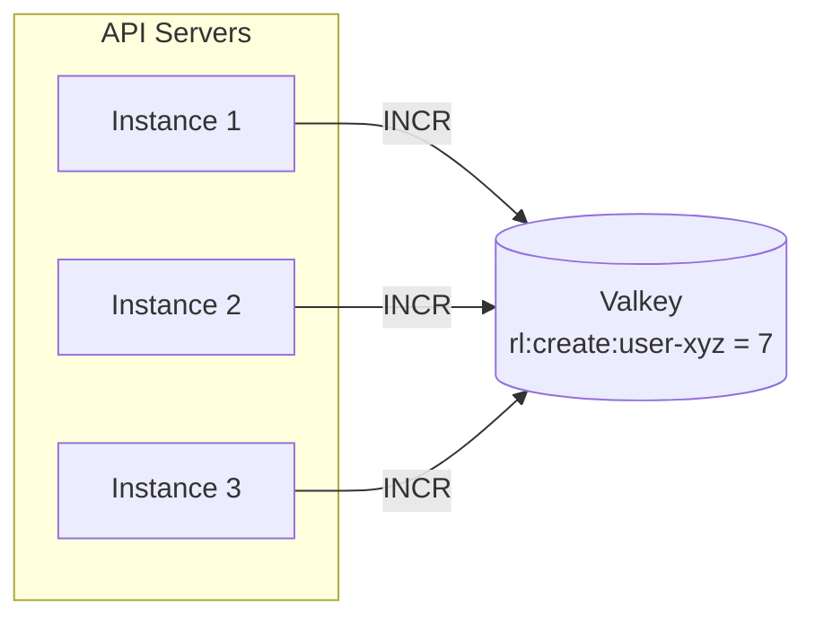

# Day 6 — Rate Limiting

## Goals

- Protect `POST /api/shorten` from per-user abuse (quota exhaustion)
- Protect `GET /:shortCode` from bot enumeration and redirect flooding
- Expose `X-RateLimit-Limit` / `X-RateLimit-Remaining` on every response so clients can self-throttle

---

## Algorithm selection

Four standard algorithms exist. Here is how they compare for this project:

| Algorithm | How it works | Burst handling | Implementation complexity | Chosen? |
|---|---|---|---|---|
| **Fixed Window Counter** | Counter resets at fixed intervals (e.g. every 60 s on the minute) | None — all requests in window are equal | Low — single atomic INCR | ✅ Yes |
| **Sliding Window Log** | Stores timestamp of every request; counts events in the last N seconds | Smooth — no boundary spike | High — stores per-request state, O(n) memory | No |
| **Token Bucket** | Tokens refill at a fixed rate; each request consumes one token | Yes — allows short bursts up to bucket size | Medium — requires Lua script for atomic read-modify-write | No |
| **Leaky Bucket** | Requests processed at a fixed output rate; overflow is dropped | None — queue drains at constant rate | Medium — requires a queue abstraction | No |

### Why fixed-window counter

**Token bucket** was the first candidate (per the expert plan) because it allows short bursts — a user creating 5 URLs in 2 seconds and then waiting 58 seconds is a valid use case. However, implementing token bucket atomically in Valkey requires a Lua script (a GET + conditional SET without Lua creates a TOCTOU race — two concurrent requests both read `tokens: 1`, both pass, both consume the last token). That script adds operational complexity.

**Fixed window with `INCR`** avoids the race entirely: `INCR` is a single atomic command in Valkey. No Lua, no `WATCH/MULTI/EXEC`, no conditional logic. The trade-off is the boundary spike — a user can make 10 requests at 00:59 and 10 more at 01:01, effectively 20 in 2 seconds without triggering a 429. For this project that is acceptable because:

1. The create limit (10/60 s per user) protects quota, not a payment-sensitive operation
2. The redirect limit (100/60 s per IP) is high enough that a boundary spike is not a meaningful exploit
3. Correct > complex at this stage; Token Bucket can be introduced if real abuse patterns emerge

---

## How the fixed-window counter works

### Single request flow



### Why INCR is race-free

The naive (broken) token bucket approach:

```
GET tokens          ← two concurrent requests both read "1"
if tokens > 0:
  SET tokens = 0    ← both write 0; both proceed; limit bypassed
```

With `INCR`, Valkey serialises the increment server-side. Two concurrent requests increment to `1` and `2` respectively — never the same value:

```
INCR key  →  1   (request A, atomically)
INCR key  →  2   (request B, atomically)
```

No Lua script needed. Atomicity is inherent.

---

## Architecture: why Valkey, not in-process

In a horizontally scaled deployment each API server instance has its own memory. An in-process counter means 5 instances each allow 10 creates/min → effective limit is 50. Centralising the counter in Valkey means all instances share one counter regardless of how many are running.



---

## Fail-open decision

If Valkey is unreachable the `rateLimitCheck` wrapper in `plugins/cache.ts` catches the error and returns `{ allowed: true, count: 0 }`. The request proceeds; the 429 is never thrown.

This means a Valkey outage causes temporary rate limit bypass, not a service outage. For a URL shortener this is the correct default — a brief window of unthrottled traffic is preferable to making the redirect and create paths completely unavailable.

The `count: 0` on fail-open means `X-RateLimit-Remaining` reports the full window limit during an outage, which is the most honest signal a client can receive when no real counter exists.

---

## Limits applied

| Route | Key pattern | Limit | Window |
|---|---|---|---|
| `POST /api/shorten` | `rl:create:{userId}` | `RATE_LIMIT_CREATE_LIMIT` (default 10) | `RATE_LIMIT_WINDOW_SECS` (default 60 s) |
| `GET /:shortCode` | `rl:redirect:{ip}` | `RATE_LIMIT_REDIRECT_LIMIT` (default 100) | `RATE_LIMIT_WINDOW_SECS` (default 60 s) |

Scoping by `userId` (not IP) on the create route means users behind a shared IP (corporate NAT) are not penalised for each other's activity.

---

## Response headers

On every response from a rate-limited route:

```
X-RateLimit-Limit: 10
X-RateLimit-Remaining: 3
```

On 429 only (set by global error handler via `RateLimitError`):

```
Retry-After: 42
```

`Math.max(0, limit - count)` guards `X-RateLimit-Remaining` when `count` overshoots `limit` (the over-limit case where headers still go out before the error is thrown).

---

## Changes made today

### `shared/src/rateLimitCheck.ts`
Added `count: number` to `RateLimitResult`. The Valkey `INCR` value was already in scope — now it is returned so middlewares can compute `remaining` without an extra round-trip.

```ts
// before
type RateLimitResult = { allowed: boolean; retryAfter: number };

// after
type RateLimitResult = { allowed: boolean; retryAfter: number; count: number };
```

### `server/{api,redirect}/src/plugins/cache.ts`
Fail-open return updated to satisfy the new type:
```ts
return { allowed: true, retryAfter: 0, count: 0 };
```

### `server/{api,redirect}/src/middleware/rateLimit.ts`
`_reply` → `reply` (was unused). Two headers added after the Valkey check, before the allowed/denied branch:

```ts
reply.header('X-RateLimit-Limit', options.limit);
reply.header('X-RateLimit-Remaining', Math.max(0, options.limit - result.count));
if (!result.allowed) {
  throw new RateLimitError(result.retryAfter);
}
```

Headers are set unconditionally — both allowed and denied responses carry them so clients always know their current quota state.
