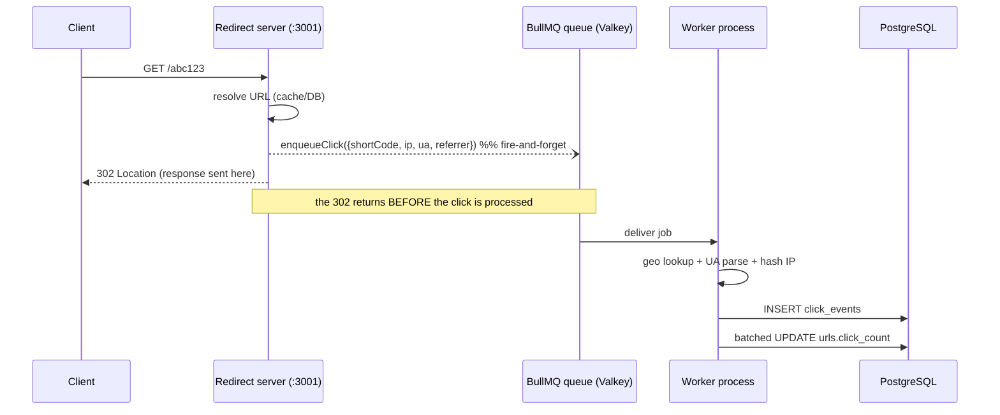
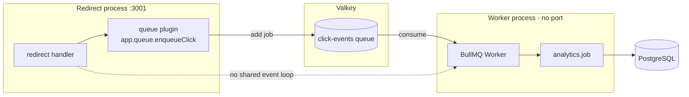
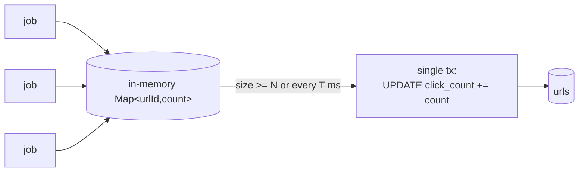

# Day 7 — Async Analytics Pipeline (BullMQ)

## Goals

- Record a click event on **every** redirect without adding latency to the hot path (`GET /:shortCode` must stay <10 ms p99)
- Decouple the *write rate* (clicks arriving) from the *processing rate* (geo lookup + UA parse + DB insert)
- Survive worker crashes and Valkey blips without losing the redirect or the click
- Lay the write side of the analytics CQRS split that Day 9's read routes consume

---

## The core decision: why a queue at all

A redirect has two jobs: send the user to the target URL, and record that the click happened. These have opposite latency profiles.

| | Redirect (the user is waiting) | Click write (nobody is waiting) |
|---|---|---|
| Latency budget | < 10 ms p99 | seconds is fine |
| Work | one cache/DB read | UA parse + external geo API + DB insert |
| Failure tolerance | must not fail | can be retried later |

The math (from `DECISIONS.md` #4) makes the conflict concrete. At ~1,200 redirects/sec, if each redirect synchronously did a 10 ms click insert, that's **12 seconds of blocking work per wall-clock second** — the redirect path collapses. The geo lookup (an external HTTP call) is far worse: a 2 s timeout on the hot path would be catastrophic.

So the click write must happen **after** the response is sent. A message queue is the buffer between the fast producer (redirect) and the slow consumer (worker):



---

## Why BullMQ (not the alternatives)

| Approach | Decouples latency? | Survives restart? | Retries? | Backpressure? | Chosen? |
|---|---|---|---|---|---|
| **Sync `await db.insert()` in redirect** | No | n/a | No | No | No — defeats the whole point |
| **`setImmediate` / fire-and-forget Promise in-process** | Partially | No — in-flight clicks lost on crash | No | No | No — no durability, shares the redirect event loop |
| **Raw Redis `LPUSH`/`BRPOP`** | Yes | Yes | Hand-rolled | Hand-rolled | No — reinventing a job queue |
| **BullMQ (Redis/Valkey-backed)** | Yes | Yes — jobs persist in Valkey | Built-in (attempts + backoff) | Built-in (concurrency cap) | ✅ Yes |

BullMQ is already justified by the stack: Valkey is present for caching and rate limiting, so the queue adds **no new infrastructure**. It gives durable jobs (a click survives a worker restart — it sits in Valkey until consumed), declarative retry with exponential backoff, a failed-set for poison messages, and a concurrency limit — all things we'd otherwise hand-roll on raw Redis lists.

---

## Design pattern 1 — Producer / Consumer across process boundaries

The producer (redirect server) and consumer (worker) run as **separate OS processes**, not as a worker thread inside the redirect server.



Why separate (per the project structure doc, which overrides DECISIONS #10's "same-process initially"):

- **Latency isolation** — a batch DB write or a slow geo call cannot steal CPU from the redirect event loop. They are different processes.
- **Crash isolation** — a worker exception (or OOM) cannot take down the redirect server. Jobs stay queued; the worker restarts and resumes.
- **Independent scaling** — redirects and analytics processing scale on different axes. Need more throughput? Run more worker processes against the same queue.

The cost is "one extra `npm run dev`". Accepted.

### The shared contract

The queue name and job payload type live in `@url-shortener/shared` (`src/queue.ts`), imported by both producer and consumer:

```ts
export const CLICK_QUEUE = 'click-events';
export type ClickJob = { shortCode: string; ip: string; userAgent?: string; referrer?: string; ts: number };
```

This is deliberate: producer and consumer are in different packages and must never drift on the queue name or the payload shape. The contract is the single source of truth — change the payload here and both sides fail to compile until they agree.

---

## Design pattern 2 — Fire-and-forget (the one rule that matters)

In the redirect handler, the enqueue is **never awaited**:

```ts
// redirect/src/routes/redirect.ts — on BOTH the cache-hit and cache-miss paths
void app.queue.enqueueClick(buildClickJob(request, shortCode));
return reply.header('Cache-Control', 'no-cache').redirect(url.originalUrl, 302);
```

If you accidentally `await` this, you've reintroduced the exact latency the queue exists to remove. The `void` is intentional and load-bearing.

Two subtleties:

1. **Both paths enqueue.** The cache hit is ~95% of traffic; if only the cache-miss path recorded clicks, analytics would be almost entirely empty. The payload carries `shortCode` (the only key both paths have), so the worker resolves the URL id itself — no need to thread the id through the cache.
2. **The producer fails open.** `enqueueClick` wraps `queue.add()` in try/catch and only logs a warning on failure (`plugins/queue.ts`). A Valkey/queue outage costs us a click event, not a redirect. Losing analytics data is acceptable; breaking the hot path is not. This mirrors the fail-open stance already used for the cache and rate limiter.

---

## Job payload design — why we ship the raw IP

The payload carries the **raw client IP**, not a pre-hashed one. This looks wrong against the "never store/log raw IP" privacy rule, so the reasoning matters:

- The worker performs **geo enrichment** via `ip-api.com`, which needs the *real* IP. A hash is useless for geolocation.
- The raw IP lives only **transiently** inside the job (in Valkey, for seconds) and inside the worker's memory during processing. It is **never persisted to Postgres and never logged**.
- Before insert, the worker converts it to `ip_hash` and discards the raw value.

The alternative — geo-locating on the redirect server before enqueuing — would put a 2 s external call back on the hot path. Rejected for the same reason we went async in the first place.

`shortCode` (not `urlId`) is the URL key because the cache-hit path doesn't have the id. The worker does one indexed lookup (`short_code` is unique) to resolve it — cheap, and it's off the hot path so latency is irrelevant.

---

## Worker pipeline (`analytics.job.ts`)

Per click job, in order:

1. **Resolve** `shortCode → url.id`. Null (unknown/hard-deleted URL) → discard the job, no retry.
2. **Geo** lookup (best-effort, see below) → `{ countryCode, city }` or nulls.
3. **Parse UA** with `ua-parser-js` → `deviceType` (mobile/tablet/desktop/bot/unknown), `browser`, `os`.
4. **Hash IP** with a rotating daily salt (see below).
5. **Referrer** → hostname only (`new URL(referrer).hostname`), or `null`. `'direct'` is applied later at read time, not stored.
6. **Insert** the `click_events` row.
7. **Record** the click into the in-memory batch accumulator for the denormalized counter.

### IP hashing — daily-salted SHA-256

A plain `SHA-256(ip)` is reversible: the IPv4 space is only ~4 billion values, trivially brute-forced with a rainbow table. The design spec calls for `SHA-256(IP + daily_salt)`:

```ts
const day = new Date().toISOString().slice(0, 10);      // YYYY-MM-DD (UTC)
createHash('sha256').update(`${ip}:${day}:${IP_HASH_SECRET}`).digest('hex');
```

The daily salt does double duty:

- **Privacy** — the hash is non-reversible and rotates every day.
- **Unique-visitor counting** — the same IP on the same UTC day produces the *same* hash, so the aggregation job can count unique visitors via `COUNT(DISTINCT ip_hash)`. A per-request random salt would break that.

> Set `IP_HASH_SECRET` in the worker's production environment — it defaults to a dev placeholder.

---

## Design pattern 3 — Write-behind batching for the denormalized counter

`urls.click_count` is a denormalized counter (so the dashboard never runs `COUNT(*)` over billions of rows). The question is how to keep it current.

| Strategy | DB writes at 1,200 clicks/s | Crash-loss risk | Chosen? |
|---|---|---|---|
| **DB trigger on insert** | 1,200 row-locks/s on the hot `urls` rows | none | No — lock contention on popular URLs |
| **Per-job `UPDATE … +1`** | 1,200 UPDATEs/s | none | No — write amplification, row-lock contention |
| **Batched accumulator (write-behind)** | one UPDATE per URL per flush window | last unflushed window | ✅ Yes |

The worker accumulates counts in a `Map<urlId, count>` and flushes on **size** (`CLICK_BATCH_SIZE`) **or interval** (`CLICK_FLUSH_MS`), whichever comes first, as a single transactioned multi-`UPDATE`. 1,000 clicks to one URL become one `click_count += 1000` instead of 1,000 separate updates — matching the section-4/5 design.

The accepted trade-off is **eventual consistency**: a crash loses at most the current unflushed window of counts (the raw `click_events` rows are already durable, so the true count is always recoverable). On a transient flush failure the batch is re-queued into the map rather than dropped. Graceful shutdown does a final flush before exit.



---

## Error handling — the worker is its own error domain

There is no HTTP request, no reply, no global error handler here. Each failure is classified (per `exception-handling-strategy.md`):

| Failure | Class | Strategy | Log level |
|---|---|---|---|
| URL unknown / hard-deleted (resolve → null) | Expected race | Discard job, **no retry** | WARN |
| `P2003` FK gone between resolve and insert | Expected race | Discard job, **no retry** | WARN |
| Geo API timeout / error / reserved IP | Expected | Fall back to `country: null`, **save the click anyway** | DEBUG |
| Prisma connection error (P1001/P1017) | Exceptional | **Rethrow** → BullMQ retries with backoff | ERROR |
| Job exhausts all retries | Exceptional | Lands in BullMQ failed set; alert | ERROR |

The key insight: **retrying a P2003 always fails again** (the URL is gone), so retrying just generates noise and a false alert. Discard it. Conversely, a DB connection blip *will* succeed on retry, so let it throw and let BullMQ's backoff handle it.

The only try/catch blocks in the worker are the legitimate ones: the geo lookup (bounded operation with a documented null fallback) and the P2003 classification at insert. Everything else bubbles to BullMQ.

Retry policy on the queue (set once as `defaultJobOptions` in the producer):

```ts
{ attempts: 3, backoff: { type: 'exponential', delay: 1000 }, removeOnComplete: true, removeOnFail: 1000 }
```

`removeOnComplete: true` keeps Valkey from filling with succeeded jobs; `removeOnFail: 1000` retains the last 1,000 failures for inspection.

---

## Graceful shutdown ordering

On SIGTERM/SIGINT the worker drains cleanly so in-flight clicks aren't lost (`worker.ts`):

1. Stop the cron task (no new aggregation runs)
2. Clear the flush interval
3. `worker.close()` — finishes the jobs currently being processed, stops pulling new ones
4. **Final batch flush** — persist any counts still in the accumulator
5. `prisma.$disconnect()` then `connection.quit()`

Order matters: close the worker *before* the final flush so no new clicks land in the map after it's drained.

---

## Connection note — the ioredis duplication trap

BullMQ pins `ioredis` to an exact patch (`5.10.1`) while the rest of the repo uses `^5.11.1`. npm installed **two physical copies**, and TypeScript treated `Redis` from each as nominally incompatible — `new Redis(...)` from our copy wasn't assignable to BullMQ's `ConnectionOptions`. Fixed with a root `overrides` in `server/package.json` forcing a single hoisted `ioredis`:

```jsonc
"overrides": { "ioredis": "5.11.1" }
```

Also note BullMQ **requires** `maxRetriesPerRequest: null` on its connection — set on both the producer's queue connection and the worker's connection.

---

## Configuration

| Env var | Default | Purpose |
|---|---|---|
| `VALKEY_URL` | `redis://localhost:6379` | Queue backend (shared with cache) |
| `WORKER_CONCURRENCY` | `10` | Max jobs processed in parallel |
| `CLICK_BATCH_SIZE` | `100` | Flush the counter batch at this many pending URLs |
| `CLICK_FLUSH_MS` | `5000` | Flush the counter batch at least this often |
| `GEO_ENABLED` | `true` | Toggle ip-api.com enrichment |
| `GEO_TIMEOUT_MS` | `2000` | Per-job geo lookup timeout (AbortController) |
| `IP_HASH_SECRET` | dev placeholder | Secret mixed into the daily IP-hash salt — **set in prod** |

---

## Files created / changed

### `shared/src/queue.ts` (new) + `index.ts`
The shared contract: `CLICK_QUEUE` constant and `ClickJob` type, exported for both producer and consumer.

### `redirect/src/plugins/queue.ts` (new)
BullMQ `Queue` producer as a Fastify plugin, mirroring `plugins/cache.ts`. Decorates `app.queue` with a fail-open `enqueueClick`. Dedicated ioredis connection (`maxRetriesPerRequest: null`); `onClose` hook closes the queue.

### `redirect/src/routes/redirect.ts`
Replaced the Day-4 placeholder comment with `buildClickJob(...)` + `void app.queue.enqueueClick(...)` on **both** the cache-hit and cache-miss return paths. Registered the plugin in `app.ts`.

### `worker/` (new package)
Separate process. `worker.ts` (entry: batch accumulator, BullMQ Worker, cron, graceful shutdown), `jobs/analytics.job.ts` (the consumer pipeline), `repositories/click-event.repository.ts` (resolve / insert / batch-increment), plus `db.ts`, `config.ts`, `logger.ts`, and a minimal Prisma schema (migrations stay owned by `api`).

### `server/package.json`
Added `worker` to `workspaces`; added the `ioredis` override.

> Day 9 (analytics read routes + the nightly `aggregation.job.ts` that rolls raw `click_events` into `daily_analytics_aggregates`) consumes the output of this pipeline — it is documented separately. The pipeline built here is the **write** side of that CQRS split.
