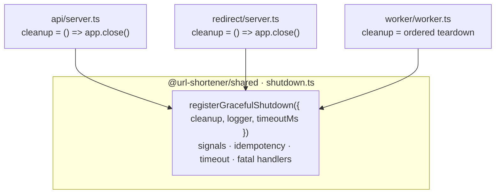
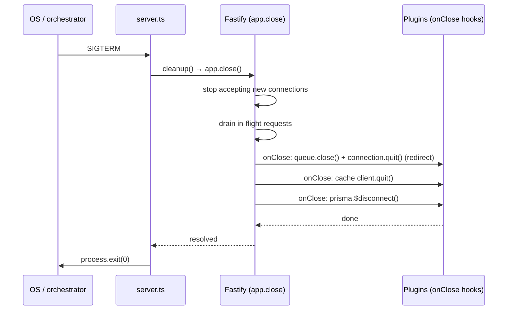
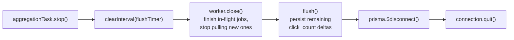

# Day 10 — Graceful Shutdown + Error Handling

## Goals

- Make **all three** long-running processes (`api`, `redirect`, `worker`) respond to `SIGTERM`/`SIGINT` by **draining in-flight work and releasing every connection** before exit — no half-open sockets, no leaked DB pools, no lost click batches.
- Add the production-grade safety rails the original per-service shutdown blocks were missing: an **idempotency guard** (a second signal can't race the drain), a **force-exit timeout** (a hung cleanup can't wedge the pod past the orchestrator's kill window), and **fatal-error handlers** (`unhandledRejection` / `uncaughtException`).
- Do it **once**, in `@url-shortener/shared`, so the three processes can never drift apart again.
- Re-assert that the **centralized HTTP error handler** Day 10's plan asks for already exists and is contract-compliant — this day is about the *process* error domain, not the *request* one.

This is a "production hardening" day: nothing new is exposed; the processes just die correctly.

---

## What was already in place (and what was actually missing)

Like Day 8, Day 10 is partly an audit. The section-7 plan lists two deliverables — *graceful shutdown* and a *centralized error handler* — and one of them was already done well.

| Plan item | Status before today | Action today |
|---|---|---|
| Centralized HTTP error handler | ✅ Built on Days 2–8 — `app.setErrorHandler` in both `api/app.ts` and `redirect/app.ts`, mapping `AppError`, Prisma codes, and Fastify validation to the locked `ERROR_CONTRACT` envelope | None — re-verified, left untouched |
| `unhandledRejection` handler | ⚠️ Worker only, and it only *logged* (never exited) | Replaced with a handler that logs **and** drains with a non-zero exit |
| `uncaughtException` handler | ❌ Absent in all three processes | Added everywhere via the shared helper |
| Graceful shutdown — worker | ✅ Full inline drain (stop cron, close worker, final flush, disconnect) | Refactored onto the shared helper (gained timeout + uncaughtException) |
| Graceful shutdown — api / redirect | ⚠️ `app.close()` + `process.exit(0)` only | Refactored onto the shared helper (gained idempotency, timeout, fatal handlers) |

So the net-new work is: **a shared shutdown helper, fatal-error handling on every process, and a force-exit timeout** — not a new error handler.

### The HTTP error handler is *not* re-touched — and why

The section-7 plan sketches an Express-style centralized handler returning `{ code, message, fields }` with `422` for validation. Our project does not follow that sketch, deliberately:

- We are on **Fastify**, not Express — the handler is `app.setErrorHandler`, registered once per server in `app.ts`, not `app.use((err, req, res, next) => …)`.
- The envelope is the **locked** `ERROR_CONTRACT.md` shape `{ error, details?, retryAfter? }`, and validation failures are **`400`**, not `422` (same call made on Day 8). The plan's `422`/`{ code, message }` is illustrative, not binding.

Rewriting a working, contract-locked handler to match a generic plan snippet would be a regression. It stays as-is.

---

## The core decision: one shared helper, not three inline blocks

The original three processes each hand-rolled their own `process.on('SIGTERM', …)`. They had already drifted:

| | api | redirect | worker (before) |
|---|---|---|---|
| Drains connections | ✅ `app.close()` | ✅ `app.close()` | ✅ explicit sequence |
| Idempotency guard | ❌ | ❌ | ✅ |
| Force-exit timeout | ❌ | ❌ | ❌ |
| `unhandledRejection` | ❌ | ❌ | ⚠️ log-only |
| `uncaughtException` | ❌ | ❌ | ❌ |
| Logs via | `console.log` | `console.log` | structured `logger` |

This is exactly the drift the shared package exists to kill (same reasoning as the `CLICK_QUEUE` contract on Day 7 and `rateLimitCheck` on Day 6). The shutdown concerns are **identical** across processes; only the *cleanup body* differs. So the lifecycle logic moves into `shared/src/shutdown.ts` and each process supplies just its `cleanup` callback.



### The contract

```ts
export interface GracefulShutdownOptions {
  cleanup: () => Promise<void>;   // drains/closes everything this process owns
  logger: ShutdownLogger;         // Fastify app.log OR a bare pino instance
  timeoutMs?: number;             // force-exit ceiling, default 30_000
}
export function registerGracefulShutdown(options: GracefulShutdownOptions): void;
```

`ShutdownLogger` is the minimal `{ info, error }` shape that both Fastify's `app.log` and the worker's standalone pino instance already satisfy — so the helper doesn't have to import pino or couple to Fastify.

---

## Why `cleanup` is the only per-process difference

### Fastify servers — `app.close()` does the cascade

Both servers pass `() => app.close()`. That single call is enough because **every resource is owned by a plugin, and every plugin registered an `onClose` hook**. `app.close()` stops the listener, drains in-flight requests, then runs those hooks in reverse registration order:



This is why the server `cleanup` is a one-liner — the Day 1–8 plugins (`db/index.ts`, `plugins/cache.ts`, `plugins/queue.ts`) already close themselves correctly. We don't re-list them in `server.ts`; doing so would duplicate (and drift from) the plugin lifecycle.

### Worker — explicit ordered teardown

The worker has no Fastify instance, so it passes its own sequence. **Order is load-bearing** (unchanged from Day 7, now wrapped in the helper):



The critical step is **close the worker *before* the final flush**: stop new clicks from landing in the accumulator first, *then* drain what's left. Flushing first would race jobs still being processed.

---

## Safety rail 1 — the force-exit timeout

`app.close()` (or the worker drain) can hang: a stuck DB pool, a socket whose peer never FINs, a wedged Valkey `quit()`. Without a backstop the process sits there until the orchestrator escalates `SIGTERM → SIGKILL` (k8s: 30 s grace, then hard kill — which loses whatever the drain was protecting).

So the helper arms a timer the moment a drain starts:

```ts
const killTimer = setTimeout(() => {
  logger.error({ timeoutMs }, 'Graceful shutdown timed out — forcing exit');
  process.exit(1);
}, timeoutMs);
killTimer.unref();
```

Two details that matter:

- **`unref()`** — the timer must not, by its own existence, keep the event loop alive. Once `cleanup()` resolves and we `clearTimeout`, the process can exit naturally; the timer is purely a deadline, never a reason to stay up.
- **`timeoutMs` defaults to 30 000 but is configurable** via `SHUTDOWN_TIMEOUT_MS`, and is meant to sit **under** the orchestrator's own grace window so *we* decide how we die, not `SIGKILL`.

---

## Safety rail 2 — fatal-error handlers (the non-zero exit matters)

A promise that rejects with no `.catch`, or a synchronous throw that escapes every frame, leaves Node in an **undefined state**. The exception-handling strategy is explicit about the worker case ("uncaught exception → log full error, exit cleanly, PM2 restarts"); we apply the same rule to all three processes:

```ts
process.on('unhandledRejection', (reason) => {
  logger.error({ reason }, 'Unhandled promise rejection — shutting down');
  void drain('unhandledRejection', 1);   // ← exit code 1
});
process.on('uncaughtException', (err) => {
  logger.error({ err }, 'Uncaught exception — shutting down');
  void drain('uncaughtException', 1);     // ← exit code 1
});
```

| Trigger | Exit code | Why |
|---|---|---|
| `SIGTERM` / `SIGINT` | `0` | Expected, clean termination — the orchestrator asked us to stop |
| `unhandledRejection` / `uncaughtException` | `1` | Abnormal — signals the supervisor (PM2 / k8s) to **replace** the instance rather than leave it running half-broken |

The change from the worker's old behaviour is deliberate: previously `unhandledRejection` was *logged and ignored*, leaving a potentially corrupt process alive to process more jobs. Now it drains and exits non-zero so a clean instance takes over. We still attempt `cleanup()` on the fatal path (best-effort), and the timeout rail guarantees we exit even if that cleanup is the thing that's wedged.

---

## Safety rail 3 — idempotency guard

`SIGTERM` can arrive twice (orchestrator retries), or a signal can land while a fatal handler is *already* draining. Without a guard, `cleanup()` runs twice — double `$disconnect()`, double `quit()`, racing `process.exit` calls.

```ts
let shuttingDown = false;
async function drain(trigger, exitCode) {
  if (shuttingDown) { logger.info({ trigger }, 'Shutdown already in progress — ignoring'); return; }
  shuttingDown = true;
  // …
}
```

First trigger wins; every later one is logged and dropped. (The worker already had this; the servers did not.)

---

## A note on `process.exit` and `console.error` at the very top

`server.ts`'s outer `try/catch` and the final `start().catch(...)` still use `console.error` + `process.exit(1)`. That is intentional: those cover failures **before `app` exists** (e.g. `app.listen` throws on `EADDRINUSE`, a plugin fails to register). There is no `app.log` to use yet, and there is nothing to drain — the process never came up. Once the server is listening, everything goes through the structured-logging drain.

---

## Configuration

| Env var | Default | Purpose |
|---|---|---|
| `SHUTDOWN_TIMEOUT_MS` | `30000` | Force-exit ceiling if `cleanup()` hangs. Shared by all three processes (lives in `getCommonConfig()`). Keep it below the orchestrator's `SIGTERM→SIGKILL` grace window. |

Added to the shared `commonEnvSchema` with `z.coerce.number().int().positive()` so a bad value fails loudly at startup rather than silently disabling the backstop.

---

## Files created / changed

### `shared/src/shutdown.ts` (new)
`registerGracefulShutdown({ cleanup, logger, timeoutMs })` — the whole lifecycle: SIGTERM/SIGINT wiring, idempotency guard, `unref()`'d force-exit timer, and `unhandledRejection`/`uncaughtException` handlers. Exposes the minimal `ShutdownLogger` interface so it couples to neither Fastify nor pino.

### `shared/src/config.ts`
Added `SHUTDOWN_TIMEOUT_MS` (coerced number, default `30000`) to `commonEnvSchema` and `getCommonConfig()`, so all three processes read it off `config` via the `...common` spread.

### `shared/src/index.ts`
Exported `registerGracefulShutdown` + the `GracefulShutdownOptions` / `ShutdownLogger` types.

### `api/src/server.ts` / `redirect/src/server.ts`
Replaced the hand-rolled `process.on('SIGTERM'/'SIGINT', …)` blocks with `registerGracefulShutdown({ cleanup: () => app.close(), logger: app.log, timeoutMs: config.SHUTDOWN_TIMEOUT_MS })`. Now log through the structured Fastify logger instead of `console.log`, and gain the timeout + fatal handlers they lacked.

### `worker/src/worker.ts`
Replaced the inline `shutdown()` function, its two signal handlers, and the log-only `unhandledRejection` with a single `registerGracefulShutdown` call whose `cleanup` keeps the exact Day-7 teardown order (stop cron → clear flush timer → `worker.close()` → final `flush()` → `disconnect()` → `connection.quit()`). Net gains: force-exit timeout and a real `uncaughtException` handler.

---

## Verification summary

| Check | Result |
|---|---|
| `tsc --noEmit` on `shared` | ✅ clean |
| `tsc --noEmit` on `api` | ✅ clean |
| `tsc --noEmit` on `redirect` | ✅ clean |
| `tsc --noEmit` on `worker` | ✅ clean |
| Existing HTTP error handler (ERROR_CONTRACT envelope) | ✅ unchanged, re-verified |
| All three processes share one shutdown implementation | ✅ |
| Drain order preserved in worker (close-before-flush) | ✅ |
| Signals → exit 0; fatal errors → exit 1 | ✅ |

### Manual test (per the section-7 plan)

```powershell
# Start a server, then in another shell send the termination signal:
Stop-Process -Id <pid>            # or Ctrl-C in the dev shell (SIGINT)
# Expect in the logs:
#   "Graceful shutdown started"  { trigger: 'SIGTERM' }
#   "Database disconnected" / "Valkey cache disconnected" / "Click queue disconnected"
#   "Graceful shutdown complete"
# Process exits 0, no hanging connections.
```

> The `api` and `redirect` servers now drain exactly like the `worker` already did since Day 7 — and all three share one tested implementation, so the next process added to the monorepo inherits correct shutdown for free.
