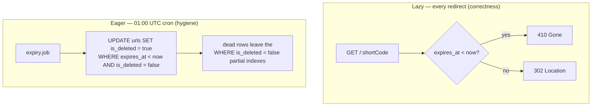
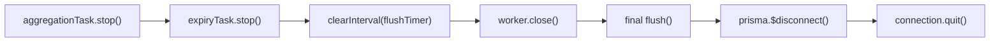

# Day 11 — Link Expiry + Background Jobs

## Goals

- Guarantee an expired link is **never followed**: the redirect path must return `410 Gone` the instant `expires_at` has passed — checked at read time, on both the cache and DB paths.
- Add the **eager** counterpart: a nightly sweep that soft-deletes expired URLs so dead rows fall out of the hot partial indexes instead of accumulating forever.
- Keep both halves consistent with the project's locked invariants — **soft delete only** (analytics history must survive) and the **`410` vs `404`** distinction (gone-for-good vs never-existed).

This is a "production hardening" day in the same vein as Days 8 and 10: nothing new is exposed, and — as with those days — **half the deliverable was already built**. The work is one new background job plus an audit of the lazy path.

---

## The two-part expiry strategy

Expiry needs two mechanisms that solve two different problems. Conflating them is the classic mistake.

| | Lazy expiry (read-time) | Eager expiry (cron sweep) |
|---|---|---|
| Question it answers | "Is *this* link expired *right now*?" | "Which links are *already* expired and cluttering the table?" |
| When it runs | On every redirect | Once nightly (01:00 UTC) |
| Guarantees | **Correctness** — never serves a stale link, to the second | **Hygiene** — keeps indexes/storage small |
| Cost | One comparison already on the hot path | One bulk `UPDATE`, off the hot path |
| If you only had this one | Table grows unbounded with dead rows | A link stays followable for up to ~24h after expiry |

The plan calls both out explicitly ("Both needed: Correctness + storage management"). Lazy is load-bearing for correctness; eager is an optimization. They are **not** redundant — eager alone would leave a window where an expired link still redirects (until the next nightly run), and lazy alone would let the `urls` table fill with tombstones that bloat every index scan.



---

## What was already in place (the lazy half)

Lazy expiry was built on **Day 4** (redirect server) and survived the Day 5 cache layer unchanged. Re-verified today, untouched:

```ts
// redirect/src/routes/redirect.ts
// ── cache-hit path ──
if (cached.expiresAt !== null && new Date(cached.expiresAt) < new Date()) {
  throw new GoneError();            // 410
}
// ── DB-miss path ──
if (url.expiresAt !== null && url.expiresAt < new Date()) throw new GoneError();
```

Two properties make this correct **without** any extra negative-cache key:

1. **The cache stores `expiresAt`, not just the URL.** The cached payload (`CachedUrl`) carries `expiresAt`, so a *cache hit* on an expired link still evaluates the comparison and returns `410`. The cache can't serve a link the DB would reject.
2. **The cache TTL is capped at the link's remaining lifetime.** Day 5's `cacheTtl()` writes `min(remaining-seconds, 24h)`, so a cached entry for an expiring link evaporates from Valkey around the moment it expires anyway. The `expiresAt` check is the belt; the capped TTL is the suspenders.

`GoneError` maps to `410` through the locked error handler (`utils/errors.ts` → global handler), distinct from the `NotFoundError` → `404` used for codes that never existed. The plan's `410` for expired and `404` for missing is already honored.

### Why no separate `url:{code}:expired` negative-cache key

The section-7 plan sketches an optional negative entry (`valkey.set('url:abc:expired', true, 'EX', 30)`) checked before the redirect. **We deliberately don't add it**, because the two properties above already deliver what it would: an expired link returns `410` from the cache-hit path directly (point 1), and the entry self-evicts on the capped TTL (point 2). A second key would mean an *extra Valkey round-trip on the hot path* to defend against a case the existing single lookup already covers — net negative for a redirect server whose entire budget is <10ms p99. (Same reasoning shape as Days 8/10: follow the plan's *intent*, not a snippet that fights an existing, better mechanism.)

---

## The net-new half — the eager cleanup job

A nightly cron in the **worker** process (never the redirect or api hot paths). It lives where the structure doc places it — `worker/src/jobs/expiry.job.ts` — alongside the Day 9 `aggregation.job.ts`, and follows that job's exact shape: a factory returning a runner, an injectable `referenceDate` for testability, and **errors swallowed** so a cron failure can never crash the long-running worker.

### The query — soft delete, never hard delete

```sql
UPDATE urls
SET is_deleted = true, updated_at = NOW()
WHERE expires_at IS NOT NULL
  AND expires_at < $now
  AND is_deleted = false
```

- **`is_deleted = true`, never `DELETE`** — the locked delete-strategy decision. `click_events` and `daily_analytics_aggregates` rows reference these URLs; a hard delete would destroy the analytics history the whole pipeline exists to preserve. The row stays, flagged dead.
- **`AND is_deleted = false`** — idempotent and cheap. Already-swept rows are skipped, so re-running the job (or a second run after a missed night) touches only genuinely-new expirations and the affected-row count stays honest.
- **`expires_at IS NOT NULL`** — links with no expiry are permanent; never in scope.

This runs as **raw SQL via `prisma.$executeRaw`**, matching `aggregate.repository.ts`. That choice means the worker's deliberately-minimal Prisma model (which omits `expires_at`) doesn't need to grow a column just for one `WHERE` clause, and `$executeRaw` returns the affected-row count directly — exactly the "deleted N expired URLs" number the plan asks us to log.

It sits behind a repository (`worker/src/repositories/url.repository.ts`) per the **"all Prisma calls → repository layer"** rule — the job orchestrates and logs; the repository owns the SQL.

### Scheduling and shutdown

```ts
// worker.ts — a second cron beside the 00:05 aggregation run
const runExpiryCleanup = createExpiryJob(urlRepo);
const expiryTask = cron.schedule('0 1 * * *', () => void runExpiryCleanup(), { timezone: 'UTC' });
```

`01:00 UTC` is **after** the `00:05 UTC` aggregation run by design: yesterday's clicks are rolled into `daily_analytics_aggregates` *before* any expired URLs are swept, so aggregation never races a row being marked dead. Both are pinned to `timezone: 'UTC'` so the cleanup boundary doesn't drift with the host's local time / DST.

`expiryTask.stop()` was added to the shared graceful-shutdown `cleanup` (Day 10), right beside `aggregationTask.stop()` — so a SIGTERM mid-evening stops scheduling new sweeps before the process drains. No partial-sweep risk: the `UPDATE` is a single atomic statement, not a long loop.



---

## Why the cleanup job does **not** touch Valkey

The structure doc's one-line description of `expiry.job` mentions "DEL from Valkey". It isn't necessary, for the same reason the negative-cache key isn't:

- A cached entry for a now-expired URL still carries `expiresAt`, so the redirect's read-time check returns `410` regardless of the `is_deleted` flag the sweep just set. Both `is_deleted` and `expired` map to the **same** `410 Gone` response — the cache can't produce a wrong answer.
- The capped TTL means that entry is already on its way out of Valkey.

So adding a Valkey client to the worker purely to delete keys the lazy path already neutralizes would be cost without benefit (and the worker would need a cache connection it otherwise doesn't have). The sweep stays a pure DB-hygiene operation. Should a future change ever let the cache outlive a link's expiry, the invalidation hook belongs on the **api** server's mutation paths (where `app.cache.del` already lives for PATCH/DELETE), not in this cron.

---

## Error handling — cron is its own domain (no HTTP)

Like the aggregation job, the expiry job has no request, no reply, no global error handler. The policy:

| Failure | Strategy | Log level |
|---|---|---|
| Transient DB error during the `UPDATE` | Log and **swallow** — the next nightly run retries the same idempotent query | ERROR |
| Job runs, soft-deletes 0 rows | Normal — nothing expired since last run | INFO (`deleted: 0`) |

A cron callback that throws would bubble to the Node process; swallowing inside the job keeps the worker alive to process clicks and run tomorrow's sweep. The idempotent `WHERE` means a swallowed failure self-heals on the next run with no double-counting.

---

## Configuration

No new env vars. The schedule (`0 1 * * *`, UTC) is a fixed operational constant alongside the existing aggregation schedule; `SHUTDOWN_TIMEOUT_MS` (Day 10) already covers the cron's clean stop.

---

## Files created / changed

### `worker/src/repositories/url.repository.ts` (new)
`createUrlRepository(prisma)` exposing `softDeleteExpired(now)` — the idempotent soft-delete `UPDATE` via `$executeRaw`, returning the affected-row count. Keeps all Prisma access in the repository layer.

### `worker/src/jobs/expiry.job.ts` (new)
`createExpiryJob(repo)` → `runExpiryCleanup(referenceDate = now)`. Mirrors `aggregation.job.ts`: injectable reference date, INFO start/complete logs (with the deleted count), errors logged-and-swallowed.

### `worker/src/worker.ts`
Imported the new repo + job; added the `01:00 UTC` cron (`expiryTask`) beside the aggregation cron; added `expiryTask.stop()` to the graceful-shutdown `cleanup` sequence.

### `redirect/src/routes/redirect.ts` (unchanged — re-verified)
The Day-4 lazy `expires_at < now → GoneError (410)` checks on both the cache-hit and DB-miss paths satisfy the lazy half. Left untouched.

---

## Verification summary

| Check | Result |
|---|---|
| `tsc --noEmit` on `worker` | ✅ clean |
| Lazy expiry returns `410` on cache-hit path (carries `expiresAt`) | ✅ (Day 4, re-verified) |
| Lazy expiry returns `410` on DB-miss path | ✅ (Day 4, re-verified) |
| `410` (expired) distinct from `404` (never existed) | ✅ |
| Cleanup uses soft delete (`is_deleted = true`), never hard `DELETE` | ✅ |
| Cleanup query idempotent (`AND is_deleted = false`) | ✅ |
| Expiry cron pinned to `01:00 UTC`, after the `00:05` aggregation | ✅ |
| `expiryTask` stopped in graceful shutdown | ✅ |
| All worker Prisma access behind the repository layer | ✅ |

### Manual test (per the section-7 plan)

```
1. Create a URL with expiresAt ≈ 2 minutes out.
2. Redirect immediately            → 302 (followed).
3. Wait past expiresAt, redirect   → 410 Gone (lazy check fires).
4. Trigger runExpiryCleanup(now)   → logs "soft-deleted 1 expired URLs";
   the row now has is_deleted = true in the DB (analytics rows still present).
```

> Day 11 completes the expiry story: the redirect path was already correct (lazy, Day 4); today adds the nightly hygiene sweep (eager) so the `urls` table and its partial indexes don't accumulate dead rows. Both halves honor soft-delete and the `410`/`404` split.
