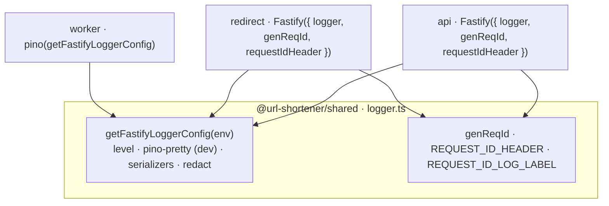

# Day 12 — Structured Logging

## Goals

- Make every log line on all three processes (`api`, `redirect`, `worker`) **machine-parseable JSON** in production, with human-pretty output in dev — no `console.log`, no string concatenation.
- Stamp every request with a **request id** that is (a) adopted from an upstream `X-Request-ID` if present, (b) minted as a UUID otherwise, (c) echoed back on the response, and (d) attached to every per-request log line — so a single request is traceable across services by one grep.
- Enforce the project's **no-PII / no-secret logging** rule at the logging layer itself: the raw client IP, `Authorization`/`Cookie` headers, and any `password` field must never reach a log sink, regardless of what a handler passes in.

This is a "production hardening" day in the same vein as Days 8, 10, and 11 — and, like those, **most of the deliverable was already in place.** The structured logger was wired on Day 1 (Fastify ships pino); the net-new work is request-id correlation, a privacy-safe request serializer, and secret redaction.

---

## What was already in place (and what was actually missing)

The section-7 plan lists five tasks: install pino, create a logger, request-id middleware, log every request, never log secrets. Auditing the codebase, three of the five were already done — Fastify's built-in pino logger has covered them since Day 1.

| Plan item | Status before today | Action today |
|---|---|---|
| Install pino + pino-pretty | ✅ Day 1 — Fastify bundles pino; `pino-pretty` is a dep on all three packages | None |
| Central logger instance | ✅ `shared/logger.ts:getFastifyLoggerConfig(env)`, consumed by both servers and the worker's standalone `pino()` | Extended (serializers + redact) |
| Log every request (method, path, status, duration) | ✅ Fastify auto-logs `incoming request` + `request completed` with `responseTime` — no manual middleware needed | Added `userId` binding |
| Request-ID generation + propagation | ⚠️ Fastify auto-assigns `req-1`, `req-2`… but never **echoes** it, never adopts an **upstream** id, and labels it `reqId` not `requestId` | **Net-new** — `genReqId` + `requestIdHeader` + response-header hook |
| Never log secrets / raw IP | ❌ Fastify's **default request serializer logs `remoteAddress`** (raw client IP) on every request | **Net-new** — custom `req` serializer + `redact` |

So the net-new work is: **request-id correlation, a raw-IP-free request serializer, and secret redaction** — not a new logger.

### Why the Express-style per-request middleware in the plan is *not* built

The section-7 plan sketches an Express middleware (`app.use((req,res,next) => { req.id = uuid(); res.on('finish', …) })`) that manually times the request and logs on `finish`. We are on **Fastify**, which already does this natively and better:

- Fastify creates a **per-request child logger** (`request.log`) carrying the request id, and emits `incoming request` / `request completed` lines automatically, with `responseTime` (duration in ms) baked in.
- Re-implementing that as a hand-rolled `onResponse` hook would duplicate — and inevitably drift from — a maintained code path, for zero gain.

So, exactly as on Days 8/10/11, we follow the plan's **intent** (structured per-request logs with id, status, duration) via the framework's idiom, not the literal Express snippet.

---

## Decision 1 — centralize in `shared`, not per-process

The logger config already lived in `@url-shortener/shared` (`getFastifyLoggerConfig`), consumed by:

- `api` and `redirect` via `Fastify({ logger: getFastifyLoggerConfig(env) })`, and
- `worker` via `pino(getFastifyLoggerConfig(env))` (no Fastify instance there).

Every Day-12 enhancement to the pino options (serializers, redaction) therefore lands in **one file** and applies to **all three processes** automatically — the same anti-drift reasoning behind the `CLICK_QUEUE` contract (Day 7), the shared `rateLimitCheck` (Day 6), and the shared shutdown helper (Day 10).

The request-id **constants and generator** (`REQUEST_ID_HEADER`, `REQUEST_ID_LOG_LABEL`, `genReqId`) also live in `shared/logger.ts`. They are plain values + a function over `node:crypto` — **no Fastify import** — so `shared` stays decoupled from the web framework (the same constraint that kept `shutdown.ts`'s `ShutdownLogger` free of a pino/Fastify dependency). `genReqId` uses `crypto.randomUUID()` rather than the `uuid` package so `shared`'s only runtime dependency remains `zod`.



---

## Decision 2 — the request id: adopt, mint, echo, label

Four behaviours, all configured at the Fastify-instance level (plus one hook):

```ts
const app = Fastify({
  logger: getFastifyLoggerConfig(config.NODE_ENV),
  genReqId,                                 // mint a UUID when no upstream id
  requestIdHeader: REQUEST_ID_HEADER,        // 'x-request-id' — adopt upstream id if present
  requestIdLogLabel: REQUEST_ID_LOG_LABEL,   // 'requestId' — log key (plan's sample uses this, not 'reqId')
});

app.addHook('onRequest', (request, reply, done) => {
  reply.header('X-Request-ID', request.id);  // echo on EVERY response, incl. error envelopes
  done();
});
```

| Behaviour | Mechanism | Why |
|---|---|---|
| **Adopt** an upstream id | `requestIdHeader: 'x-request-id'` | A redirect → worker (or gateway → api) chain shares one id, so a click can be traced end-to-end across processes — the plan's "correlation ID: match logs across services". |
| **Mint** when none supplied | `genReqId = () => randomUUID()` | A UUID is unguessable and collision-free, unlike Fastify's default sequential `req-N` (which resets to `req-1` on every restart and collides across instances). |
| **Echo** back to the caller | `onRequest` hook setting `X-Request-ID` | A client (or our own Postman suite) can quote the id when reporting a problem; Fastify does **not** set this response header on its own. Done in `onRequest` so the header survives onto 4xx/5xx envelopes too. |
| **Label** it `requestId` | `requestIdLogLabel` | Matches the plan's sample log output, so doc greps and real logs line up. |

The hook is two lines and lives inline in each `app.ts` (rather than in `shared`) precisely because the response-header step is the only piece that needs the Fastify `reply` object — keeping `shared` framework-free. This mirrors the per-server inline error handlers, which also differ slightly between `api` and `redirect`.

---

## Decision 3 — the privacy-safe request serializer (the load-bearing fix)

This is the real defect Day 12 closes. Fastify's **default** request serializer logs the raw client IP on every single request:

```jsonc
// Fastify default "incoming request" line — note remoteAddress:
{"level":30,"reqId":"req-1","req":{"method":"GET","url":"/abc123","host":"...","remoteAddress":"203.0.113.7","remotePort":54734},"msg":"incoming request"}
```

The project rule (and the plan's "Never log raw IPs") forbids this. We override the `req` serializer in the shared pino options to emit only the non-sensitive triple:

```ts
serializers: {
  req(req) {
    return { method: req.method, url: req.url, id: req.id };
  },
},
```

`remoteAddress`/`remotePort`/`host` are dropped entirely. The `res` and `err` serializers are left as pino/Fastify defaults (status code and stack are not sensitive and are needed for debugging).

This is consistent with the rest of the system's IP stance: the **worker** already hashes the IP with a daily salt before it ever touches Postgres (Day 7); the redirect server passes the raw IP only **transiently** into the fire-and-forget click job and never logs it. Day 12 closes the last leak — the framework's own access log.

> The serializer is defined in `shared`, so it also applies to the worker's pino instance. The worker never logs a `req` object, so it is inert there — but defining it once means the rule can't be forgotten if a future process does log requests.

---

## Decision 4 — redaction as defense-in-depth

Even with headers stripped by the serializer, a future log line could pass a request body or a user object containing a secret. `redact` censors those paths unconditionally:

```ts
redact: {
  paths: [
    'req.headers.authorization',   // belt — serializer already drops headers
    'req.headers.cookie',          // belt — refresh cookie
    'res.headers["set-cookie"]',   // Set-Cookie on the login/refresh responses
    'password',                    // a body logged at top level
    '*.password',                  // a nested user/credentials object
  ],
  censor: '[REDACTED]',
},
```

The `authorization`/`cookie` paths are inert given the serializer (no headers survive to redact), but they are kept as **suspenders**: if the serializer is ever loosened, the secrets are still censored. The meaningful live paths are `password` / `*.password` and `set-cookie`.

Verified (production config, standalone pino):

```jsonc
{"level":30,"password":"[REDACTED]","user":{"password":"[REDACTED]"},"ok":"visible","msg":"redaction smoke test"}
```

---

## Decision 5 — `userId` on the request log, because it is *not* PII

The plan's sample line includes `userId`. Fastify's automatic `request completed` log uses the request's child logger, so the clean way to add `userId` is to **re-bind that child** the moment auth succeeds:

```ts
// api/src/middleware/auth.ts — after JWT verification
request.userId = payload.userId;
request.log = request.log.child({ userId: payload.userId });
```

Every subsequent log line for that request — including the auto-emitted completion line — now carries `userId`, with no manual per-handler logging.

The distinction that makes this safe: a **user id is an opaque internal identifier**, not personally-identifying. The email address *is* PII and is never logged (the auth service deliberately keeps it out of logs). This is the line the plan draws ("✅ Request ID, status, duration; ❌ passwords, raw IPs, emails") and we hold it: id yes, email no.

The redirect server is unauthenticated, so it has no `userId` to bind — its logs carry `requestId` only, which is correct.

---

## Log output, before vs after

**Development** (pino-pretty, unchanged formatting — `level: debug`):

```
[10:23:14 +00:00] INFO (requestId=71f7…): request completed
    req: { "method": "GET", "url": "/api/urls", "id": "71f7…" }
    res: { "statusCode": 200 }
    responseTime: 4.2
    userId: "usr_abc"
```

**Production** (JSON to stdout, `level: info`):

```jsonc
{"level":30,"time":1781422329936,"requestId":"71f7…","userId":"usr_abc","req":{"method":"GET","url":"/api/urls","id":"71f7…"},"res":{"statusCode":200},"responseTime":4.2,"msg":"request completed"}
```

No `remoteAddress`. No `authorization`. No `password`. `requestId` present and echoed on the response as `X-Request-ID`.

---

## Configuration

No new env vars. Logging behaviour keys off the existing `NODE_ENV` (already in the shared `commonEnvSchema`):

| `NODE_ENV` | Level | Transport |
|---|---|---|
| `development` | `debug` | `pino-pretty` (colorized) |
| `production` | `info` | none — raw JSON to stdout (for the log aggregator) |
| `test` | `warn` | none |

The request-id header name (`x-request-id`) and log label (`requestId`) are fixed operational constants in `shared/logger.ts`, not env-tunable — they are part of the cross-service contract.

---

## Files created / changed

### `shared/src/logger.ts`
Extended the pino options shared by all three processes:
- `serializers.req` — emits `{ method, url, id }` only, **dropping `remoteAddress`** (the raw-IP fix).
- `redact` — censors `password` / `*.password` / `set-cookie` (and Authorization/Cookie as belt-and-suspenders).
- New exports `genReqId` (`crypto.randomUUID`), `REQUEST_ID_HEADER` (`'x-request-id'`), `REQUEST_ID_LOG_LABEL` (`'requestId'`) — plain values, no Fastify coupling.

### `shared/src/index.ts`
Re-exported the three new request-id symbols alongside `getFastifyLoggerConfig`.

### `api/src/app.ts` / `redirect/src/app.ts`
Passed `genReqId` / `requestIdHeader` / `requestIdLogLabel` to the `Fastify({ … })` constructor, and added the `onRequest` hook that echoes `X-Request-ID` on every response (including error envelopes).

### `api/src/middleware/auth.ts`
After JWT verification, re-bind `request.log` to a child carrying `userId`, so the automatic request-completion line is attributed to the authenticated user.

---

## Verification summary

| Check | Result |
|---|---|
| `tsc --noEmit` on `shared` / `api` / `redirect` / `worker` | ✅ all clean |
| Production config emits JSON; `password` / nested `*.password` → `[REDACTED]` | ✅ (pino smoke test) |
| `genReqId` produces a v4 UUID | ✅ |
| Response carries `X-Request-ID` (minted UUID) when no upstream id | ✅ (Fastify inject) |
| Upstream `X-Request-ID` is adopted and echoed unchanged | ✅ (Fastify inject) |
| Per-request logs use the `requestId` label | ✅ (Fastify inject) |
| Logs contain **no** `remoteAddress` / raw IP | ✅ (Fastify inject) |
| Authenticated `api` request-completion line carries `userId` | ✅ (child-logger binding) |
| redirect logs carry `requestId`, no `userId` (unauthenticated) | ✅ |

### Manual test (per the section-7 plan)

```powershell
# Dev: make a request and watch pretty logs carry a requestId
Invoke-WebRequest http://localhost:3000/health -Method GET
#   → response header  X-Request-ID: <uuid>
#   → stdout           "incoming request" / "request completed" with requestId=<uuid>, responseTime

# Correlation: supply your own id and see it flow through the logs unchanged
Invoke-WebRequest http://localhost:3000/health -Headers @{ 'X-Request-ID' = 'trace-abc' }
#   → response header  X-Request-ID: trace-abc
#   → logs             requestId="trace-abc"
```

> Day 12 completes the observability story: structured JSON logs were present since Day 1, but the raw client IP was leaking into every access-log line. Today closes that leak, adds end-to-end request-id correlation (adopt → mint → echo → label), and censors secrets at the sink — all centralized in `shared` so the next process added to the monorepo inherits correct, privacy-safe logging for free.
