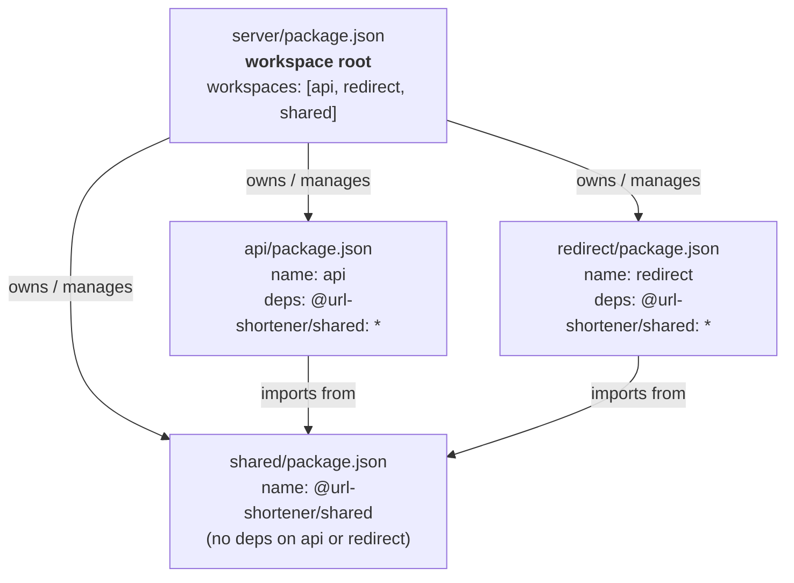
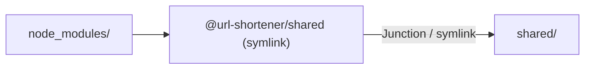

# npm Workspaces & the `shared` Package

**Audience:** Backend developers new to the monorepo setup.

---

## What Problem Does This Solve?

Both `api` and `redirect` servers need the same rate-limit algorithm (Valkey `INCR + EXPIRE`). Without a shared package, that logic lives in two files and drifts over time. `shared` is the single source of truth for any utility both servers consume.

---

## Directory Layout

```
server/                        ← workspace root (package.json lives here)
├── package.json               ← declares workspaces: ["api", "redirect", "shared"]
├── api/                       ← workspace package  name: "api"
├── redirect/                  ← workspace package  name: "redirect"
└── shared/                    ← workspace package  name: "@url-shortener/shared"
    └── src/
        ├── rateLimitCheck.ts  ← shared algorithm
        └── index.ts           ← public re-exports
```

---

## How the Three `package.json` Files Relate



**Key rule:** dependency only flows one way — `api` and `redirect` depend on `shared`; `shared` never imports from them.

---

## What `npm install` Does at Root

Running `npm install` from `server/` does three things:

1. **Installs** each package's external `node_modules` (e.g. `ioredis`, `fastify`).
2. **Hoists** shared dependencies to `node_modules/` to avoid duplication.
3. **Symlinks** `node_modules/@url-shortener/shared` → `shared/`.



When `api` does `import { rateLimitCheck } from '@url-shortener/shared'`, Node resolves it through this symlink to the **live TypeScript source** — no build step needed in development.

---

## Why `"exports"` Points to `.ts` Source

```json
// shared/package.json
"exports": {
  ".": {
    "types":   "./src/index.ts",
    "default": "./src/index.ts"
  }
}
```

Both servers run with `tsx` (esbuild under the hood), which handles `.ts` files natively. Pointing `exports` straight at the TypeScript source means:

- **Dev:** `tsx` compiles shared on-the-fly alongside the server — zero build step.
- **Types:** TypeScript resolves the `.ts` source directly — full intellisense, no separate `.d.ts`.
- **Prod:** Add a `build` script to `shared` later that compiles to `dist/` and update `exports` — zero changes needed in consumers.

---

## Adding a New Shared Utility

1. Create `shared/src/myUtil.ts`.
2. Re-export it from `shared/src/index.ts`.
3. Import in any server: `import { myUtil } from '@url-shortener/shared'`.
4. No `npm install` needed — the symlink is already live.

---

## Common Commands

```bash
# Run from server/ — installs all workspaces and links shared
npm install

# Type-check shared in isolation
cd shared && npm run type-check

# Check which packages are linked
npm ls --workspaces
```

---

## What Belongs in `shared` vs. Each Server

| Shared (`shared/`) | Keep local to each server |
|---|---|
| Pure algorithm functions (rate-limit, base62) | Fastify plugins (`app.decorate`) |
| Shared TypeScript types / interfaces | Route handlers |
| Environment config schema (future) | Prisma models / DB calls |
| Logger factory (future) | Server-specific error subclasses |
